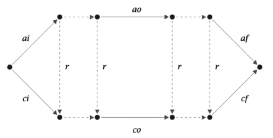

# Translation of Z specifications to executable code: Application to the database domain

**Saeed Khalafinejad** $^{a,*}$, **Seyed-Hassan Mirian-Hosseinabadi** $^b$

$^a$ *School of Engineering and Science, Sharif University of Technology-International Campus, Kish Island, Iran*  
$^b$ *Department of Computer Engineering, Sharif University of Technology, Tehran, Iran*

---

### ABSTRACT

**Context:** It is well-known that the use of formal methods in the software development process results in high-quality software products. Having specified the software requirements in a formal notation, the question is how they can be transformed into an implementation. There is typically a mismatch between the specification and the implementation, known as the specification-implementation gap.  
**Objective:** This paper introduces a set of translation functions to fill the specification-implementation gap in the domain of database applications. We only present the formal definition, not the implementation, of the translation functions.  
**Method:** We chose Z, SQL and Delphi languages to illustrate our methodology. Because the mathematical foundation of Z has many properties in common with SQL, the translation functions from Z to SQL are derived easily. For the translation of Z to Delphi, we extend Delphi libraries to support Z mathematical structures such as sets and tuples. Then, based on these libraries, we derive the translation functions from Z to Delphi. Therefore, we establish a formal relationship between Z specifications and Delphi/SQL code. To prove the soundness of the translation from a Z abstract schema to the Delphi/SQL code, we define a Z design-level schema. We investigate the consistency of the Z abstract schema with the Z design-level schema by using Z refinement rules. Then, by the use of the laws of Morgan refinement calculus, we prove that the Delphi/SQL code refines the Z design-level schema.  
**Results:** The proposed approach can be used to build the correct prototype of a database application from its specification. This prototype can be evolved, or may be used to validate the software requirements specification against user requirements.  
**Conclusion:** Therefore, the work presented in this paper reduces the overall cost of the development of database applications because early validation reveals requirement errors sooner in the software development cycle.

---

## 1. Introduction

### 1.1. Motivation

Applying formal methods early in the software development process improves the quality of the software artifacts in the later stages of the development [1–4]. In fact, formal methods prevent the propagation of the requirement specification errors to the later phases of the development process. Consequently, the overall cost of a software project is dramatically lower because of the reduction in defect rates [3]. The main activity, after the formal specification of the user requirements, is the conversion of the formal requirements to an implementation. There is typically a mismatch between the specification and the implementation, known as the specification-implementation gap [5].

Refinement [6–8] is a major paradigm for filling the specification-implementation gap. However, in the real process of software development, refinement has not been so beneficial because it can be used only to demonstrate the consistency of an implementation against an abstract specification, and does not guide the developer regarding how to convert the specification to the implementation. In most cases, the developer must know the implementation and prove its consistency against the specification by using refinement. Although there are refinement tools, such as RED [9], that suggest to the developer which refinement laws are applicable, refinement theory by itself does not provide any guidance for the rules application. Furthermore, most formal methods fail to address the methodological aspects of software development [2,3]. Formal methods are not truly methodical because they do not offer ordered steps and guidance for moving between specifications [2], although the B-Method [10] addresses this issue to some extent [2].

The translation of a high-level specification language to an executable implementation is highly useful in filling the specification-implementation gap; it also prevents errors that originate from the manual translation of specifications to code [11,12]. Consequently, formal methods can be used more effectively in the software development process. Although such a translation is problematic because formal specifications are not generally executable [13], it is widely accepted that, within a specific application domain, considerable progress can be achieved in the code generation from specifications [14,4,15,5].

### 1.2. Overview

In this paper, we will introduce a set of translation functions to fill the specification-implementation gap in the domain of database applications. We chose Z [7,8], SQL [16] and Delphi [17] languages to illustrate our methodology. Z is a popular language for specifying software requirements, and SQL is a high-level language for querying relational databases. The choice of relational databases will be effective because they have many properties in common with the mathematical foundation of Z [16,18,19]. Delphi includes powerful components and libraries useful in exploiting the properties of SQL. The Delphi code for database applications is smaller than that of other languages, such as Java and C#, because most of the code for working with databases is implemented in Delphi components and libraries. So, less code must be generated and the translation process is simpler and easier.

We intend to derive the translation functions to establish a formal relationship between Z specifications and Delphi/SQL code. The derived functions become a basis for automatic code generation from specifications in the domain of database applications. The focus of our approach is on the prototyping of database applications. We provide a formal basis, not a tool, for prototyping. First, we define a subset of Z syntax that is suitable for specifying database applications. Then, the translation functions are applied on software requirements expressed in this Z subset, such that the output is a combination of SQL and Delphi codes that provides both non-visual constructs and a Graphical User Interface (GUI). Any specification outside of the defined Z syntax must be manually refined to this syntax. Fig. 1 shows the overall process of software development using our translation functions.


```

+-------------------------------------------------------+
|                    Z specifications                   |
+-------------------------------------------------------+
|
| Translation to the defined Z syntax (manual
v refinement)
+-------------------------------------------------------+
| Z specifications written in accordance with the       |
| defined Z syntax                                      |
+-------------------------------------------------------+
|
| Translation to executable code by using our
v translation functions (automatic refinement)
+-------------------------------------------------------+
|                      Delphi + SQL                     |
+-------------------------------------------------------+

```
**Fig. 1.** Development phases.

The translation functions generate a simple GUI that is adequate for exercising the Delphi/SQL code. So, the proposed approach is especially useful for the rapid prototyping of database applications. On the one hand, the generated prototype can be used at the beginning of the software project for the validation of the software requirements specification against user needs. On the other hand, the generated code is like a typical one written by a programmer and can be manually extended, if desired. Therefore, the generated prototype can be either an evolutionary or, at least, a throw-away one. Consequently, the proposed approach results in database applications that are cost-effective, because of early validation, and more reliable, because of automatic code generation.

### 1.3. Paper structure

Section 2 briefly introduces the refinement theory and the Z, SQL and Delphi languages. We present related works in Section 3. Section 4 presents the translation functions from Z to SQL and Delphi, and illustrates the translation process by means of an example. In Section 5, we investigate the soundness of the translation process by the use of the Z data refinement rules and Morgan refinement laws. Finally, Section 6 presents conclusion and suggestions for future works.

---

## 2. Background

### 2.1. The Z notation

Among formal specification languages, the Z notation [7,8] is one of the major paradigms in the documentation, design and development of a software product. Z is a typed language based on the set theory and first-order predicate calculus. Another aspect of Z is the way in which the mathematics are written. Mathematical objects and their properties are collected together in schemas, patterns of declaration and constraint [8]. The Z notation is popular because of its flexibility in separating design considerations from specifications. Z specifications can be combined with natural language to produce more readable documents.

Refinement can be combined with Z, meaning the evolution of formal models towards a more suitable implementation. The refinement must be correct which means that the refined specifications must be consistent with the original one [8]. Refinement is responsible for removing non-determinism or any uncertainty within specifications.

A typical Z specification document includes given sets that are used as types, state schemas and operation schemas. Also, there exists an initial schema which defines the initial state of a system. Below, we examine these elements by means of an example.

#### 2.1.1. The birthday book example

A sample Z specification is shown in Fig. 2 (taken from [7]), in which $[\text{NAME}, \text{DATE}]$ indicate given sets, $BirthdayBook$ indicates a state schema, and $AddBirthday$ and $FindBirthday$ indicate operation schemas.

$[\text{NAME}, \text{DATE}]$

$$
\begin{array}{l}
BirthdayBook \\
\hline
known : \mathbb{P}~\text{NAME} \\
birthday : \text{NAME} \rightarrowtail \text{DATE} \\
\hline
known = \text{dom}~birthday \\
\hline
\end{array}
$$

$$
\begin{array}{l}
AddBirthday \\
\hline
\Delta BirthdayBook \\
name? : \text{NAME} \\
date? : \text{DATE} \\
\hline
name? \notin known \\
birthday' = birthday \cup \{ name? \mapsto date? \} \\
\hline
\end{array}
$$

$$
\begin{array}{l}
FindBirthday \\
\hline
\Xi BirthdayBook \\
name? : \text{NAME} \\
date! : \text{DATE} \\
\hline
name? \in known \\
date! = birthday(name?) \\
\hline
\end{array}
$$

**Fig. 2.** The *Birthday Book* specification.

The $BirthdayBook$ state schema is divided into two parts by the central line. The declaration part (the part above the central line) declares state variables, and the constraint or predicate or axiom part (the part below the central line) defines the relationship between the state variables. The declaration part declares the variables $known$ that is a set of people, and $birthday$ that relates people with their birth date. The constraint part must be true in every state of the system, and must be maintained by every operation on it. The constraint part of the $BirthdayBook$ schema denotes that $known$ is the set of people with birthday recorded.

The $AddBirthday$ schema adds somebody's birthday to the $birthday$ function. The $\Delta$ symbol (schema inclusion) before the $BirthdayBook$ schema introduces four variables: $known$, $birthday$, $known'$ and $birthday'$. The first two are called before state or unprimed variables, and the last two are called after state or primed variables. These variables must satisfy the constraint defined by the $BirthdayBook$ schema. This means that the $\Delta$ symbol adds both primed and unprimed versions of the constraint part of $BirthdayBook$ to $AddBirthday$. The $name?$ and $date?$ variables are the inputs for the $AddBirthday$ schema. By convention, the inputs are followed by a question mark.

The constraint part of the $AddBirthday$ schema denotes that $name?$ must not be already in the domain of the $birthday$ function, if this is the case then the tuple $name? \mapsto date?$ must exist in the after state of the $birthday$ function. The predicate $name? \notin known$ indicates that $name?$ cannot be in the domain of the $birthday$ function. This predicate is the precondition of $AddBirthday$ and can be calculated by using the $pre$ operator.

Pay attention that predicates are conjoined in the constraint part of $AddBirthday$ ($name? \notin known \land birthday' = birthday \cup \{name? \mapsto date?\}$). The $AddBirthday$ schema in Fig. 2 is expressed in the vertical form. It can also be written horizontally, where the declaration and constraint parts are separated by a vertical bar: $AddBirthday \hat{=} [ AddBirthday_{\text{Declaration}} \mid AddBirthday_{\text{Axiom}} ]$.

The set of names known to the system must be augmented with the new name: $known' = known \cup \{name?\}$. By using the invariants on the state before and after the operation, we can prove this:

$$
\begin{aligned}
known' &= \text{dom}~birthday' & \text{[invariant after]} \\
&= \text{dom}~(birthday \cup \{name? \mapsto date?\}) & \text{[$AddBirthday$ Spec.]} \\
&= \text{dom}~birthday \cup \text{dom}~\{name? \mapsto date?\} & \text{[property of dom]} \\
&= \text{dom}~birthday \cup \{name?\} & \text{[property of dom]} \\
&= known \cup \{name?\} & \text{[invariant before]}
\end{aligned}
$$

We use the $FindBirthday$ schema to find the birthday of a person. The input for the $FindBirthday$ schema is $name?$, and the output is $date!$. By convention, the outputs end in an exclamation mark. The $\Xi$ symbol has the same effect as the $\Delta$ symbol, except that it does not allow the change of after state variables by the schema.

We can also combine schemas by conjunction and disjunction operators. Let $S$ and $T$ be schemas. The conjunction of two schemas, written as $S \land T$, is a new schema formed by merging the declaration parts of $S$ and $T$ and conjoining their constraint parts. The disjunction of two schemas, $S \lor T$, is defined similarly; however, the constraint parts are disjoint [8].

### 2.2. Refinement

Transforming abstract specifications to more concrete specifications and investigating their consistency is called refinement. Formally, we write $R \sqsubseteq S$ to express that the specification $R$ is refined by the specification $S$. There are two different types of refinement: data refinement and operation refinement [6–8]. The data refinement is about changing abstract data types to implementable constructs and the operational refinement means transforming abstract predicates to implementable statements.

#### 2.2.1. Morgan refinement calculus

Morgan refinement calculus has been used intensively for the generation of imperative programs from abstract specifications. In Morgan's view, specifications and codes are all programs and there is a refinement order between them and there is a restricted form of program called code which can be executed directly by a computer [6]. The overall refinement of specifications to code is done in several steps, each one introducing a more concrete program: $spec \sqsubseteq Mix_0 \sqsubseteq \dots \sqsubseteq Mix_n \sqsubseteq code$ Morgan introduced a set of refinement laws to prove the correctness of code against a specification. The laws can be either applied manually or with the aid of refinement tools. The refinement tool RED [9] suggests to a developer a set of Morgan laws applicable to an abstract specification. Then, the developer, with reference to the concrete program, selects one of the suggested laws. In Morgan refinement calculus, code is Dijkstra guarded commands [20] which can be easily translated to any structural programming language such as C or Pascal. Appendix C presents some of Morgan refinement laws.

Specification statements in Morgan refinement calculus are written as $w:[pre, post]$, where $pre$ is the precondition that describes initial states, $post$ is the postcondition that describes final states, and $w$ is called the frame that lists the variables whose values may change. If the above specification statement can be executed by a computer then the effect is as follows: "If the initial state satisfies the precondition then change only the variables listed in the frame so that the resulting final state satisfies the postcondition".

There are special programs, such as $skip$ and $magic$, in Morgan refinement calculus. The $skip$ program always terminates and changes nothing. It has the empty frame and its pre and post conditions are true. The $magic$ program, also called infeasible program, always terminates and establishes the impossible false. This program cannot be executed by any computer.

#### 2.2.2. Z data refinement

A data type is defined as a set of states and a set of indexed operations on them. A data type (concrete) refines another one (abstract) with the same index set if for all purposes the concrete data type can be used in place of the abstract one. The abstract data type can be used for specifying software requirements but cannot be directly or efficiently executed by a computer. On the other hand, the concrete data type can be effectively executed by a computer.

If we restrict our attention to total relations then we can achieve a simple definition for refinement [8]. Assume $S$ and $R$ are total relations then $S \sqsubseteq R$ if $R \subseteq S$ [8]. This definition says that $R$ may remove some of the non-determinism that exists in $S$. If $S$ contains the tuples $(x, y_1)$ and $(x, y_2)$, then $R$ can be more deterministic by removing either $(x, y_1)$ or $(x, y_2)$.

In a global state space $G$, the use of a data type must begin with an initialization and finish with a matching finalization [8]. So, we can define a data type as a tuple $(X, xi, xf, \{i : \mathbb{N} \bullet xo_i\})$, where:

* $X$ is a set of states,
* $xi \in G \leftrightarrow X$ is an initialization which maps a global value (or state) to the corresponding one in $X$,
* $xf \in X \leftrightarrow G$ is a finalization which maps a value in $X$ back to the global state space, and
* $\{i : \mathbb{N} \bullet xo_i\}$ is an indexed collection of operations, such that $xo_i \in X \leftrightarrow X$.

$G$, the same as $X$, is defined as a set of states. Each state is defined as the bindings of variables to values. Suppose a state in $G$ binds the variable $g$ to the value $red$. We call this state $G1$. Hence, $g$ is bound to $red$ in $G1$. The variable $g$ may be bound to other colors in other states. For example, $g$ may be bound to the $green$ value in the state $G2$. There must be a variable (or variables) in $X$ ($X$ represents the abstract or concrete states) that corresponds to the variable $g$. Suppose the variable $x$ represents the variable $g$ and the $red$ is modeled by $1$ and $green$ by $2$. Also, let $x$ bind to $1$ and $2$ in the states $X1$ and $X2$, respectively. Because we want to model $red$ by $1$ and $green$ by $2$, we define $xi$ as $\{((G1, X1), (G2, X2))\}$. That is, the binding of $g$ to $red$ is mapped to the binding of $x$ to $1$; and the binding of $g$ to $green$ is mapped to the binding of $x$ to $2$. Thus, colors are modeled by numbers: $1$ represents $red$ and $2$ represents $green$.

Starting from the state $G1$ and by the use of $xi$ we reach to the state $X1$. Now, suppose we have an operation $xo_1 = \{(X1, X2), (X2, X1)\}$. The application of $xo_1$ on the current state (i.e. $X1$) results in the state $X2$. In $X2$, $x$ is bound to $2$ which is equivalent to the $green$ color. By the use of $xf$, we can return back to a global state. To reflect our assumption of modeling $red$ with $1$ and $green$ with $2$, we define $xf$ as $\{((X1, G1), (X2, G2))\}$. The output of $xf$ for the state $X2$ is $G2$ which is consistent with our assumption of modeling $green$ with $2$. $xf$ maps a state in $X$ to a state in $G$. So, $xf \in X \leftrightarrow G$. In other words, the finalization maps concrete or abstract states to the global states. Note that $xi$, $xo_i$, $xf$ are defined as relations because in general they should model uncertainty.

We define a program as a sequence of operations upon a data type [8]. It can be seen as a relation between input and output, started by the initialization and ended by finalization. For example, the sequence $P(\mathcal{D}) = di \mathbin{\circ_9} do_1 \mathbin{\circ_9} do_2 \mathbin{\circ_9} df$ is a program that uses the data type $\mathcal{D} = (D, di, df, \{do_1, do_2\})$. We can define $P(\mathcal{D})$ as a parameterized program $P(\mathcal{X}) = xi \mathbin{\circ_9} xo_1 \mathbin{\circ_9} xo_2 \mathbin{\circ_9} xf$ where $\mathcal{X}$ is a data type.

The relational composition operator $\mathbin{\circ_9}$ is used to combine two relations. The composition of two relations, $M$ and $N$, is a new relation, shown as $M \mathbin{\circ_9} N$, which relates the domain of $M$ to the co-domain of $N$.

Suppose two data types $\mathcal{A}$ and $\mathcal{C}$ use the same index set for their operations, then we can compare them because for every program $P(\mathcal{A})$, there exists a corresponding program $P(\mathcal{C})$ [8]. Let $r$ be a relation that relates the representation of data in $\mathcal{A}$ to that of $\mathcal{C} : r : A \leftrightarrow C$, then we can investigate the correctness of the following questions:

* Is $ci$ a subset of $ai \mathbin{\circ_9} r$? That is, can any initialization of the data type $\mathcal{C}$ be matched by an initialization of $\mathcal{A}$ that is followed by $r$?
* Is $r \mathbin{\circ_9} cf$ a subset of $af$? That is, can any finalization of $\mathcal{C}$ after an application of $r$ be matched by a finalization of $\mathcal{A}$?
* Is $r \mathbin{\circ_9} co_i$ a subset of $ao_i \mathbin{\circ_9} r$, for each index $i$? That is, can any operation in $\mathcal{C}$ be matched by the corresponding operation in $\mathcal{A}$?

If the answer to all of these questions is yes, then $r$ is called a *forward simulation* for the two data types [8]. A program step in $\mathcal{A}$ can simulate the effect of any program step in $\mathcal{C}$ [8]. Therefore, for any program $P$, $P(\mathcal{C}) \subseteq P(\mathcal{A})$ and we can say that $\mathcal{A}$ is refined by $\mathcal{C}$ [8]. This simulation can be illustrated by the commuting diagram in Fig. 3. If $r$ is a relation of type $C \leftrightarrow A$ that relates concrete and abstract states then $r$ is called a *backward simulation*. The relation $r$ is also called a retrieve relation.

<figure style="text-align: center;">
  
  <figcaption><b>Fig. 3.</b> The commuting diagram for simulation.</figcaption>
</figure>

Now, we examine how the Z data refinement relates to this relational view of refinement. A Z operation schema is actually a relation upon system states. Therefore, an operation schema is refined correctly when the corresponding relation is refined correctly [8]. Besides this, Z state schemas define system states.

The above data types, $\mathcal{A}$ and $\mathcal{C}$, can be described by the state schemas $A$ and $C$; and two operation schemas, $AO$ and $CO$, with the same index. We also need initialization schemas, $AI$ and $CI$, and finalization schemas, $AF$ and $CF$, to move between the global state space and these data types. The simulation of the two data types can be presented by another Z schema, $R$, which is also known as retrieve schema: $R \hat{=} [A; C \mid \dots]$. The schema $R$ imports the state schemas $A$ and $C$ in its declaration part and records their relationship in its constraint part. These schemas can be presented in terms of relations. Doing so for $R$, we have:

$$r = \{R \bullet \theta A \mapsto \theta C\}$$

A schema can be used in the declaration part of a set comprehension (or a quantifier). That is, its declaration and constraint parts denote the declaration and constraint parts of the set comprehension, respectively [8]. Thus, the above set comprehension, $r$, is defined based on $R$. The expression at the right-hand side of dot defines the format of the tuples in $r$. The notation $\theta$ before $A$ and $C$ indicates the bindings of the components of these schemas (the names of state variables) to the values of unprimed variables. In effect, $r$ maps bindings in the abstract state space $A$ to the corresponding bindings in $C$.

In the same vein, operation, initialization and finalization schemas can be expressed in forms of relation:

$$\begin{aligned} ao &= \{AO \bullet \theta A \mapsto \theta A'\} \\ ai &= \{AI \bullet \theta G \mapsto \theta A'\} \\ af &= \{AF \bullet \theta G \mapsto \theta A\}~^\sim \end{aligned}$$

The use of $\theta$ in conjunction with $'$ denotes the bindings of a schema components with the values of the primed variables. In other words, $\theta A$ refers to the before state values whereas $\theta A'$ refers to after state values. For instance, $ao$ relates the before state bindings to the after state ones. In the definition of $ai$ and $af$, the schema $G$ is used for the modeling of the global state space. In the case of $af$, we inverted the set comprehension by using $\sim$ because $af$ maps the abstract state values to the global ones.

Similarly, we can define $ci$, $cf$ and $co$ for the data type $\mathcal{C}$. Consequently, the data types $\mathcal{A}$ and $\mathcal{C}$ can be represented as $\mathcal{A} = (A, ai, af, \{ao\})$ and $\mathcal{C} = (C, ci, cf, \{co\})$. These definitions are exactly what we need to compare $\mathcal{A}$ and $\mathcal{C}$. Because the elements of these data types are defined based on the Z schemas, we can also investigate whether a Z schema refines another one.

This definition of refinement assumes that operation schemas are total (have a true precondition), and there is no input or output variable. The above definition should therefore be extended to cover Z partial operations (that are undefined outside of their preconditions) and input/output variables. Such an extension is described in [8] in detail. First, the input/output sequences are built in order to change the purely relation state space to the Z-like one. Second, the partial operations are converted to the total operations through the process of totalization: augmenting the source and target of a partial relation with the special element denoting undefinedness and associating the elements outside the domain with all elements in the target [8]. Then, the totalized relations denoting a simulation are rewritten by using domain and range restriction operators (untotalizing). Finally, the obtained simulations are expressed in terms of Z schemas (based on the correspondence of schemas and relations).

Fig. 4 shows the Z forward refinement rules (taken from [8]). These rules are derived based on a set of simplifying assumptions. For example, the type of input and output variables are the same in the global, abstract and concrete state spaces and therefore cannot be refined (only the refinement of state variables is allowed). Moreover, the state finalization is not needed because it is assumed that the global relational state only consists of inputs and outputs, and state components are only observable via outputs. If state components are observed indirectly by outputs, there is no need to finalize the state variables. Of course, the assumption of observing the state via outputs means that the proof of refinement depends on what parts of the state are observed by outputs. The initialization rule insists the existence of the corresponding abstract initial state for each concrete one. The applicability rule investigates the termination of the concrete operation whenever the abstract counterpart operation is guaranteed to terminate. The last rule, correctness, checks whether the results of concrete and abstract operations are consistent. In Fig. 4, the usage of a schema as a predicate means adding the constraints recorded in the schema to the corresponding quantifier [8].

$$\begin{array}{l} \text{State initialization: } \forall C' \bullet CI \Rightarrow \exists A' \bullet AI \land R' \\ \text{Applicability: } \forall A; C \bullet \text{pre } AO \land R \Rightarrow \text{pre } CO \\ \text{Correctness: } \forall A; C; C' \bullet C R \land CO \land \text{pre } AO \Rightarrow \exists A' \bullet AO \land R' \end{array}$$
**Fig. 4.** The Z forward refinement rules.

Later, more powerful Z refinement rules which allow the input/output refinement and the observation of state components independent of outputs were derived in [21,22]. In [23], we also derived the functional forms of the rules that are presented in [21,22]. These rules are shown in Fig. 27. Because of input/output refinement, there are two additional rules for input initialization and output finalization. Also, appropriate retrievals ($RIn$ and $ROut$) are introduced to relate input and output abstract variables with the concrete ones. Furthermore, the state finalization rule makes it possible to observe state variables without using outputs.

### 2.3. The SQL language

SQL is the standard language for relational systems, and it is supported by nearly every database product [16]. SQL uses a term *table* in place of a term *relation*. The formal definition of a table contains two parts: the table intention and the table extension [16]. The intention is a tuple type that defines the table attributes, each of which must be of a valid type [16]. The extension denotes the set of the tuples existing at a given moment [16]. SQL includes data definition commands, such as *Create table* and *Alter table*, and data manipulation commands, such as *Select*, *Insert*, *Delete* and *Update* [16].

### 2.4. The Delphi language

Delphi (and its Linux twin, Kylix) is an object-oriented language [17]. Its main features are its form-based approach, its extremely fast compiler, its strong database support, its close integration with Windows programming and its component technology. The most important element in Delphi is the Object Pascal language, which is derived from Pascal. Note that in Delphi the terms *component* and *library* are used interchangeably.

```pascal
1   unit Unit1;
2   ...//for sake of saving space the implementation details are replaced with three dots
3   Type
4     TForm1 = class(TForm)
5       AButton : TButton;
6       DBConn : TADOConnection;
7       AGrid : TDBGrid;
8       procedure AButtonClick(Sender : TObject);
9     Private
10      i : integer;
11      j : Longint;
12    Public
13      x : integer;
14    end;
15  ...
16  procedure TForm1.AButtonClick(Sender : TObject);
17  begin
18    //Code for AButtonClick
19  end;
20
21  end.
```

**Fig. 5.** A sample Delphi unit.

The convention in Delphi is to use the letter `T` as a prefix for the name of every class you write as well as every other type (`T` stands for Type). In Delphi, the `TObject` class is the ultimate ancestor of all classes and components. The class `TForm` represents a standard application window (form). A form can contain other objects, such as `TButton` and `TDBGrid` objects. The class `TButton` is a push button control that initiates actions. The `TDBGrid` class displays records from database tables.

The Delphi support for database applications is one of the programming environment key features. It provides many components for working with database structures, such as `TADOConnection`, `TADOQuery`, and `TClientDataSet`. The `TADOConnection` component allows you to control the attributes and conditions of a connection to a data store. The `TADOQuery` component is capable of retrieving a result set from tables in an ADO data store. The `TClientDataSet` component implements a database-independent dataset and represents an in-memory dataset.

Each Delphi Windows application consists of two main types of files: `.pas` files (Pascal or unit) and `.dfm` files (form). The Delphi classes are declared within the `.pas` files. Each Delphi `TForm` class is associated with a `.dfm` and a `.pas` file. The unit file declares the `TForm` class header and contains its implementation. The `.dfm` file defines the properties of the components located on the form.

Fig. 5 shows a Delphi Pascal file. The source code in Fig. 5 indicates that the `TForm1` class inherits all the methods, fields, properties, and events of the `TForm` class (line 4). This class has four public variables (`x`, `AGrid`, `AButton`, `DBConn`), two private variables (`i`, `j`), and one public method (`AButtonClick`). The implementation of the method follows after the class declaration. The graphical view of the class `TForm1` and parts of its `.dfm` file are shown in Fig. 6.

```pascal
object Form1: TForm1
  Left = 419
  Top = 190
  ...
  object AButton: TButton
    ...
    OnClick = AButtonClick
  end
  object AGrid: TDBGrid
    ...
  end
  object DBConn: TADOConnection
    ...
  end
end
```

**(b) The `.dfm` file.**

**Fig. 6.** The graphical view of the `TForm1` class and its `.dfm` file.

---

## 3. Related works

A semi-formal notation like UML (Unified Modeling Language) or TDL (a conceptual design language) was used as a source language in [24,25]. Then these languages were translated to B specifications, and the software development process continued by refining these specifications up to the point that it was possible to translate them into executable programs. Translation of UML diagrams to formal B specifications, then the refinement of the B specifications into B implementations, and finally the translation of the B implementations into Java and SQL codes was done in [25]. In the same vein, [24] used TDL and DBPL as source and target languages, respectively. DBPL is an integrated programming language that includes data access statements and programming structures. Although these approaches checked the consistency of B specifications, they did not prove the correctness of the translation process. The translation from UML (or TDL) to B and from concrete B specifications to Java (or DBPL) were not formally proven. These conversions were considered as syntactical translations.

Signal, Esterel and Lustre are synchronous specification languages that are widely used in the development (from specification to code generation) of real-time embedded applications [26]. These languages are popular because they are supported with mathematically sound tools. Dupuy-Chessa et al. [27] used Z and Lustre for the validation of both static and dynamic parts of UML models. UML classes automatically translated to Z specifications with proof obligations that were fed into the Z/EVES [28] theorem prover to validate the static parts. On the other hand, UML Statecharts diagrams were translated into Lustre specifications manually in order to validate the dynamic aspects of the UML model [27]. Similar approach was taken by [29,30] where UML Statecharts diagrams were transformed into Esterel and Signal specifications, respectively. These approaches did not investigate the correctness of the translation from Statecharts to the destination formal languages, nor did they consider the generation of database transactions or database schemas.

Souto et al. [31] defined a restricted version of Z grammar that could be used to define formally the structure of a database and database operations. No imperative interpretation of Z specifications was considered [31]. The specifications written in accordance with the defined syntax were translated to a relational model [31]. Also, a prototype tool was built to test the feasibility of their approach. Even though there was no formal proof that the translation retained all the properties of original Z specifications, the extensive testing of the prototype suggested that the translation was sound [31]. The VooDooM tool [32] also generates SQL `create table` commands from VDM [33] data types by using the strategic term rewriting. In contrast to our approach, VooDooM did not consider the generation of database operations (only the database schema was generated). The VDM to SQL conversion tool was developed based on the data refinement by calculation which had been presented in [34].

Alchemy [35] is a prototyping tool that compiles Alloy [36,37] specifications into the implementations that execute against persistent databases. The work enables the prototyping of database-specific applications based on Alloy. The difference between our work in this paper and Alchemy is that we use Z as the source language which is more expressive than Alloy, and in addition to database schemas, our approach generates Delphi code which provides both GUI and imperative statements for the manipulation of the database.

The translation of a subset of Object-Z (object-oriented extension of Z [38]) to Java skeletal code with design contracts was proposed in [12]. The class schema framework in Object-Z suggested a one-to-one relationship between a class schema and a Java skeletal class with its design contract [12]. The approach that was presented in [12] was based on the simple structural mapping from Object-Z to C++, which was proposed in [39]. Similarly, Qin et al. [11] used Object-Z as the source language and translated it into Spec#. None of these approaches produced the body of the class methods, so the code they generate is not executable.

A framework for code generation from B formal specification based on the component methodology was proposed in [40]. First, software components were derived from B abstract machines based on their relativity [40]. Then the software components were translated directly into code using translation rules. The proof of the translation rules was left for future work, and this approach did not consider the generation of database commands or a user interface.

In the domain of concurrent applications, the translation of Circus to JCSP [41] was proposed. JCSP [42] is a Java library for modeling CSP constructs. Circus is a combination of Z and CSP, where Z is used to define the state of the system, and CSP is used to model communication and concurrency [43]. In [41] a set of translation rules were introduced for the translation of Circus specifications to the JCSP libraries; and later in [44] and [45] a translator tool that also generates a simple GUI, and the proof of the translation correctness were presented. The translation of a combination of CSP and B to Java [46] and CSP to C [47] were also done. In order to prove the correctness of the translation from abstract specifications to code, the above works modeled the generated Java or C code using the concrete specification models and then proved that the concrete model refined the abstract model.

Shi et al. [48] defined a subset of Z for direct implementation. The target language used in [48] was Spark Ada. Similar to our approach, software requirements expressed in Z must be refined into this implementable subset of Z to be directly mappable to executable code. In contrast to our method, restrictive constraints, such as not allowing constraint part in state schemas, were defined.

ZANS [49] is a tool for animating (executing) large and useful subset of Z by converting them into Extended Guarded Commands (EGC). The extended guarded commands are an extension of Dijkstra guarded commands that can be used directly to animate a Z schema [49]. ZANS animates Z specifications using C++. Unlike our approach, the study did not generate SQL commands or investigate the correctness of the animation. Most of animation approaches, such as [50], transformed specifications to functional languages, which are, in practice, rarely used for developing database applications.

The prototyping method introduced in [51] transformed specifications to executable code and investigated its correctness. The transformation was done via a set of rules which the correctness of these rules was proven once for all and then these rules were used to transform Z specifications into Miranda expressions. Some parts of formal specifications have been implemented in Miranda so they have become pre-defined Miranda types; in this way, the amount of specifications that can be automatically prototyped becomes larger. As in our approach, schemas defined in an implicit or non-deterministic way (non-executable schemas) should go through refinement. Implicit specifications must be refined by the expressions which give the after-state values and outputs explicitly. In a case of non-determinism, specifications should be refined in such a way that just one of the possible outputs from a relation is chosen. Similar to our approach and unlike most of prototyping methods that are based on ad hoc rules, [51] introduced a systematic way of deriving correct prototypes from formal Z specifications. Compared to our approach, [51] did not generate database commands or a user interface. In addition, functional languages are not popular for the development of database applications. Also, the correct derivation of a SETL2 (a set-based language) prototype from Z specifications was addressed in [52]. The correctness of the prototype was proven based on the refinement relation and the weakest precondition predicate transformer of Z and SETL2.

Z and Larch were combined with the aim of verifying object-oriented domain analysis models [53]. The Larch family of specification languages also makes the verification of implementations possible. The similar effect is achievable by using Java and JML (Java Modeling Language) in conjunction with ESC/Java [54], where Java programs are verified against JML annotations. Model checkers [55], type checkers [56], refinement tools [9] and theorem provers [28,57] are often used by the formal community to verify the various aspects of a formal model. Model and type checkers can be used in our approach for checking the consistency and integrity of Z specifications. Also, the HOL-Z [57] theorem prover which was successfully used to prove the Z refinement proof obligations can be used in our approach for the refinement of implicit schemas. On the other hand, the Z/EVES [28] theorem prover can be used for reasoning on Z specifications such as feasibility of operation schemas.

General purpose tools such as Atelier B [58], VDMTools [59], B-Toolkit [60] and the rCOS tool [61] are helpful in utilizing formal methods. Atelier B and VDMTools are environments for developing reliable software systems based on B-Method and VDM, respectively. B-Toolkit is a tool for animating B specifications and proving the correctness of the refinements in B-Method. The rCOS tool supports component-based model driven software development using the rCOS (Refinement of Component and Object Systems). The tool is based on the construction of a correct model of the system to be verified and validated. The aim is to provide an integrated environment on top of the Eclipse [62] for software development from specifications. Although these tools can be used in the development of database applications, they are not designed for the generation of a database and its corresponding transactions from abstract specifications.

Compared to other approaches, ours is overall more comprehensive because we have covered all, not just some, of the following issues:

* We have proven the correctness of the translation process.
* Our approach translates Z specifications to a database (relational implementation).
* Our approach generates the Delphi code to manipulate the data in the database (imperative implementation).
* Our approach provides a GUI for the end-user.

---

## 4. The translation from Z to SQL and Delphi

To present the translation functions, we define a subset of the Z specification language (Section 4.1). Later, based on the subset, we introduce the translation functions for generating Delphi and SQL commands. In Section 4.2 we introduce the functions for the generation of SQL commands, and in Section 4.3 we introduce the functions for the generation of Delphi commands.

### 4.1. The supported Z syntax

We chose a subset of the Z syntax from [7] in order to define a suitable syntax to translate Z to executable code. The syntax must be suitable for specifying database applications, and it must be restricted so that it can be translated to the executable code. The aim in defining this syntax is to avoid implicit (non-executable) schemas, but in a few cases, despite the use of this syntax, a programmer can write the implicit schemas; these should be manually refined to explicit (executable) schemas. Specification case studies collected in [63] show that 94% of schemas are explicit. In the domain of database applications, this is certainly the case because of the similarity of Z and relational algebra. At least, the large majority of specifications are written explicitly in the database applications domain. Therefore, the defined Z syntax is appropriate for specifying database applications.

Informally, an explicit schema is one in which all the output or primed variables are directly or indirectly defined by the input or unprimed variables, whereas an implicit schema is one in which some of the output or primed variables are constrained by the input or unprimed variables [49]. Fig. 7 shows an explicit ($S1$) and an implicit schema ($S2$) (taken from [49]). Both of them are specifying that $q!$ and $r!$ are quotient and reminder of $x?$ divided by $y?$. In $S1$, the values of $q!$ and $r!$ are defined explicitly. Hence, $S1$ is explicit.

$$\begin{array}{l} S1 \\ \hline x?, y?, q!, r! : \mathbb{N} \\ \hline q! = x? \text{ div } y? \\ r! = x? - y? * q! \\ \hline \end{array} \qquad \qquad \begin{array}{l} S2 \\ \hline x?, y?, q!, r! : \mathbb{N} \\ \hline x? = y? * q! + r! \\ r! < y? \\ \hline \end{array}$$


**Fig. 7.** The explicit and implicit schemas.

Simply, $S1$ can be translated to the following imperative statements:

1. $q! := x? \text{ div } y?$
2. $r! := x? - y? * q!$

But, in $S2$ the values of $q!$ and $r!$ are specified with constraint they must satisfy. Therefore, $S2$ is implicit and cannot be easily converted to imperative statements. In other words, it is not trivial to convert implicit schemas to executable code.

Our approach only translates explicit schemas to executable code. Therefore, we need to determine the explicitness of an schema. An algorithm to determine whether a Z schema is explicit was given in [49]. In Section 4.3.4, we will explain this algorithm in more detail and present the definition for explicit schemas.

The restricted Z syntax is shown in Fig. 8. Comparing to the original Z syntax in [7], we have omitted the following elements:

* *Free types* which are used to define enumerated collections and recursive structures [7,8]. The notation for free type definitions adds nothing to the power of the Z language [7].
* *Axiomatic definitions* which are used to introduce global variables and to optionally specify a constraint on their values. Any axiomatic definition can be rewritten by a schema and the schema inclusion operator.
* *Generic definitions* which are used to define parameterized definitions.

And finally, some operators, such as $seq$ (sequence constructor) and $bag$ (bag constructor), which can be defined by the use of other operators. For example, $seq$ and $bag$ can be defined based on mathematical functions.

The above elements do not have any effect on the power of the Z language, but they make the writing of Z specifications easier. We assume that a Z specification consists of three paragraphs: given sets, state schemas and one or more operation schemas including an initial schema. The given sets represent entities in the software product under development, the state schemas define the state space of the software—that is, the relationship between the given sets (entities)—and the operations schemas define operations upon the state space of the software.

In the syntax, we define the non-terminal *PrimitiveType* to denote Natural numbers ($\mathbb{N}$), Integer numbers ($\mathbb{Z}$), Real numbers ($\mathbb{R}$), characters, strings, date and time. We considered date and time because they are used frequently in database applications and implemented in both SQL and Delphi. *Ident* refers to the name of a given set, variable, function or relation. *Ident* can be decorated with $?$, $!$ or $'$ to indicate the Z input, output or primed variable, respectively. Note that *Ident* can be used as a function (*PreFunc* in Fig. 8), an example of which is shown in the last line of $FindBirthday$ schema in Fig. 2. The symbol $NL$ is used to represent a new line. And *Word* refers to an undecorated name and *Number* represents an Integer, Natural or Real number.

### 4.2. Generating database schemas

In this section, we present the function s which generates SQL Create table and Alter table commands. The given sets and the state schemas are used for this translation. In [16], Date mentioned that tuples in relations constitute a set. Therefore, in order to derive database schemas, each given set is translated to a _Create table_ command in SQL. A primary key is defined for each table to represent the members of the corresponding given set.

```bnf
<Specification> ::= <Paragraph> NL ... NL <Paragraph>
<Paragraph> ::= [<Ident>, ..., <Ident>] | <SchemaBox>
<SchemaBox> ::=[<DeclPart> | <AxiomPart>]
<DeclPart> ::= <Ident>:<TypeExpr> <Sep> ... <Sep> <Ident>:<TypeExpr>
<Sep> ::= ; | NL
<TypeExpr> ::= ℙ <Expr-a> | <Expr-a> <InGen> <Expr-a> | <Expr-a>
<Expr-a> ::= <Type> ×...× <Type> | <Type>
<Type> ::= <Ident> | <PrimitiveType>
<PrimitiveType> ::= String | Char | ℕ | ℤ | ℝ | DATE | TIME
<Ident> ::= Word | Word <Decoration>
<Decoration> ::= ! | ? | ′
<InGen> ::= <RelSym> | <FunSym>
<RelSym> ::= ↔
<FunSym> ::= ⇸ | ⤔ | ⤀ | → | ↣ | ↠ | ⤖ | ↦ | ⤇
<AxiomPart> ::= <Predicate> <Sep> ... <Sep> <Predicate>
<Predicate> ::= <Expr><bolInRel><Expr> | <Predicate><PredOp><Predicate> | ¬ <Predicate> |
               True | False | (<Predicate>)
<PredOp> ::= ∧ | ∨ | ⇒ | ⇔
<bolInRel> ::= ∈ | ∉ | ≠ | = | ⊆ | ⊂ | ≤ | ≥ | < | >
<Expr> ::= <Expr><InFunc><Expr> | <PreFunc> <Expr> | <Ident> | <SetElm> | <SetExpr> |
           (<Expr>)
<InFunc> ::= ∪ | ∩ | \ | ◁ | ▷ | ◁̶ | ▷̶ | . | ⊕ | + | − | * | ÷ | mod | div
<PreFunc> ::= ran | dom | # | <Ident>
<SetExpr> ::= {} | {<SetElm>, ..., <SetElm>}
<SetElm> ::= Number | <Ident> | (<SetElm>, ..., <SetElm>)
```
Fig. 8. The supported Z syntax.

The declaration parts of the state schemas are also translated to *Create table* and *Alter table* commands. These commands result in the creation of tables (or relations) in SQL. Hence, they can be interpreted as a set. Thus, the semantics of *Create table* and *Alter table* commands are a set that is declared as Z state variables. The *DeclPart* (the declaration part) is defined as a sequence of *Ident*: *TypeExpr*s. Each *Ident* is equivalent to a table or field in the database, and the *TypeExpr* determines the structure of the table or field.

In cases that the *Ident*: *TypeExpr* is of the form $\langle Ident_1 \rangle : \langle Ident_2 \rangle \langle FunSym \rangle \langle Expr\text{-}a \rangle$, the output of the function $s$ is an *Alter table* command. In this case, $Ident_1$ indicates the name of the field of the table, and $Ident_2$ indicates the table name and $Expr\text{-}a$ indicates the structure of the field. In any other forms the output of the $s$ function is a *Create table* command.

In cases that *Ident*: *TypeExpr* is translated to a *Create table* command, *TypeExpr* is modeled by a Cartesian product in relational algebra. Each element of *TypeExpr* defines a field of the table. Primitive types are translated to the pre-defined or user-defined types in SQL based on the $m$ function (Fig. 10), and the instances of *Ident* are translated to a foreign key that refers to the primary key of the corresponding given set.

The domain of function $s$ is the set of all state schemas and the given sets, and its co-domain is SQL data definition commands. During the database schema generation, the functions *UNG*, *Null_string* and *Comment* are called. *UNG* is a function that returns a unique number in each call. The function *Null_string* returns a null string. In case there exists no equivalent translation for the input of the $s$ function (or any other translation function), the *Comment* function translates the input of the $s$ function to a comment in the destination programming language (SQL or Delphi). The outputs of these functions are shown in Table 1.

**Table 1**

*UNG*, *Null_string* and *Comment* outputs.

| Function name | Output |
| --- | --- |
| *UNG* | Returns a unique number |
| *Null_string* | Returns a null string |
| *Comment* | Returns the Z specification as a comment |

The $s$ function calls functions $s1, s2, m, s3, s4$ and $s5$. The type of these functions are shown in Fig. 9. The function $m$ generates both SQL and Delphi statements; we investigate the SQL statements in this section. The generation of Delphi statements is similar.

The definition of the $m$ function for the generation of SQL statements is shown in Fig. 10. The $m$ function maps the *String* primitive type to the SQL user-defined type *string*. In SQL, the user-defined type *string* is defined by the use of the store procedure *sp_addtype* as follows: `EXEC sp_addtype 'string', 'nvarchar(20)'`.

The data types *Char*, $\mathbb{Z}$ and $\mathbb{R}$ are translated to the pre-defined types *nchar*, *int* and *float*, respectively. The types *DATE* and *TIME* are translated to the user-defined types *date* and *time*. The data type $\mathbb{N}$ is translated to the user-defined type *nat*. The type *nat* is bound to the SQL rule *natr* to prevent the insertion of negative numbers into the database tables. The SQL commands for the generation of the SQL user-defined types are shown in Fig. 11.

As it is mentioned, the $s$ function generates the *Create table* and *Alter table* commands. We define $s$ based on the effect of the application of $s$ on the every element of the defined Z syntax. The definition of $s$ together with the definitions of the functions $s1, s2, s3, s4$ and $s5$ are shown in Fig. 12 in part and completely in Appendix A. The generated commands by these functions must be executed by an RDBMS in order to produce a database. Fig. 13 shows the *Database generation* algorithm for the generation of the database tables.

Now, we illustrate the application of the *Database generation* algorithm by means of an example. Let $ZS$ denote the *Birthday Book* specifications that is shown in Fig. 14. The application of $s$ on the $ZS$ given sets and state schemas is shown below:

$$\begin{aligned} \llbracket ZS \rrbracket^s &= \llbracket [\text{PERSON}] \rrbracket^s \llbracket BirthdayBook \rrbracket^s \\ \llbracket [\text{PERSON}] \rrbracket^s &= [\text{PERSON}]^{s1} \\ [\text{PERSON}]^{s1} &= \text{Create table TPERSON (} \\ &\qquad \text{int PERSON\_k primary key);} \\ \llbracket BirthdayBook \rrbracket^s &= \dots \end{aligned}$$

The application of $s$ on the $BirthdayBook$ state schema continues in the same way (for details see [64,65]). Also, the complete application of $s$ on the *Birthday Book* example is shown in Appendix E.

$$\begin{array}{l} \llbracket \cdot \rrbracket^s : \text{State schemas, Given sets} \rightarrow \text{SQL commands (Database definition)} \\ \llbracket \cdot \rrbracket^{s1} : \langle \text{Ident} \rangle \rightarrow \text{SQL create table commands} \\ \llbracket \cdot \rrbracket^{s2} : \langle \text{Type} \rangle, \langle \text{Type} \rangle \times \dots \times \langle \text{Type} \rangle \rightarrow \text{SQL fields declaration} \\ \llbracket \cdot \rrbracket^m : \langle \text{PrimitiveType} \rangle, \langle \text{InGen} \rangle, \langle \text{bolInRel} \rangle, \langle \text{InFunc} \rangle \rightarrow \text{SQL fields type, Delphi Functions/Constants} \\ \llbracket \cdot \rrbracket^{s3} : \langle \text{Type} \rangle \rightarrow \text{SQL fields type} \\ \llbracket \cdot \rrbracket^{s4} : \langle \text{Type} \rangle \rightarrow \text{SQL fields name} \\ \llbracket \cdot \rrbracket^{s5} : \langle \text{Type} \rangle \rightarrow \text{SQL fields declaration} \end{array}$$
Fig. 9. The type of the translation functions.

$$\begin{aligned} \llbracket \langle \text{PrimitiveType} \rangle \rrbracket^m &= \llbracket \text{String} \rrbracket^m \mid \llbracket \text{Char} \rrbracket^m \mid \llbracket \mathbb{N} \rrbracket^m \mid \llbracket \mathbb{Z} \rrbracket^m \mid \llbracket \mathbb{R} \rrbracket^m \mid \llbracket \text{DATE} \rrbracket^m \mid \llbracket \text{TIME} \rrbracket^m \\ \llbracket \text{String} \rrbracket^m &= \text{string} \\ \llbracket \text{Char} \rrbracket^m &= \text{nchar} \\ \llbracket \mathbb{N} \rrbracket^m &= \text{nat} \\ \llbracket \mathbb{Z} \rrbracket^m &= \text{int} \\ \llbracket \mathbb{R} \rrbracket^m &= \text{float} \\ \llbracket \text{DATE} \rrbracket^m &= \text{date} \\ \llbracket \text{TIME} \rrbracket^m &= \text{time} \end{aligned}$$
Fig. 10. The m function.

```sql
create rule [natr] as @n>=0;
EXEC sp_addtype 'nat', 'int';
EXEC sp_bindrule 'natr', '[nat]';
EXEC sp_addtype 'date', 'datetime';
EXEC sp_addtype 'time', 'datetime';
EXEC sp_addtype 'string', 'nvarchar(20)';
```
Fig. 11. The SQL user-defined types.

$$\begin{aligned}
\llbracket \langle \text{Specification} \rangle \rrbracket^s &= \llbracket \langle \text{Paragraph} \rangle \rrbracket^s \\
&\quad \dots \\
&\quad \llbracket \langle \text{Paragraph} \rangle \rrbracket^s \\
\llbracket \langle \text{Paragraph} \rangle \rrbracket^s &= \llbracket [\langle \text{Ident} \rangle, \dots, \langle \text{Ident} \rangle] \rrbracket^s \mid \llbracket \langle \text{SchemaBox} \rangle \rrbracket^s \\
\llbracket [\langle \text{Ident} \rangle, \dots, \langle \text{Ident} \rangle] \rrbracket^s &= \llbracket \langle \text{Ident} \rangle \rrbracket^{s1} \\
&\quad \dots \\
&\quad \llbracket \langle \text{Ident} \rangle \rrbracket^{s1} \\
\llbracket \langle \text{Ident} \rangle \rrbracket^{s1} &= \text{Create table T}\langle \text{Ident} \rangle\text{ (int }\langle \text{Ident} \rangle\text{\_k primary key);} \\
\llbracket \langle \text{SchemaBox} \rangle \rrbracket^s &= \llbracket [\langle \text{DeclPart} \rangle \mid \langle \text{AxiomPart} \rangle] \rrbracket^s \\
\llbracket [\langle \text{DeclPart} \rangle \mid \langle \text{AxiomPart} \rangle] \rrbracket^s &= \llbracket \langle \text{DeclPart} \rangle \rrbracket^s \\
\llbracket \langle \text{DeclPart} \rangle \rrbracket^s &= \llbracket \langle \text{Ident} \rangle:\langle \text{TypeExpr} \rangle \rrbracket^s \\
&\quad \dots \\
&\quad \llbracket \langle \text{Ident} \rangle:\langle \text{TypeExpr} \rangle \rrbracket^s \\
\llbracket \langle \text{Ident} \rangle:\langle \text{TypeExpr} \rangle \rrbracket^s &= \llbracket \langle \text{Ident} \rangle:\langle \text{Expr-a} \rangle \rrbracket^s \mid \llbracket \langle \text{Ident} \rangle:\mathbb{P} \langle \text{Expr-a} \rangle \rrbracket^s \mid \\
&\quad \llbracket \langle \text{Ident} \rangle:\langle \text{Expr-a} \rangle\langle \text{In-Gen} \rangle\langle \text{Expr-a} \rangle \rrbracket^s \\
\llbracket \langle \text{Ident} \rangle:\langle \text{Expr-a} \rangle \rrbracket^s &= Comment(\langle \text{Ident} \rangle:\langle \text{Expr-a} \rangle) \\
\llbracket \langle \text{Ident} \rangle:\mathbb{P} \langle \text{Expr-a} \rangle \rrbracket^s &= \text{Create table T}\langle \text{Ident} \rangle\text{ (} \\
&\quad \text{int }\langle \text{Ident} \rangle\text{\_k primary key identity,} \\
&\quad \llbracket \mathbb{P} \langle \text{Expr-a} \rangle \rrbracket^s\text{);} \\
\llbracket \mathbb{P} \langle \text{Expr-a} \rangle \rrbracket^s &= \dots \\
\llbracket \langle \text{Ident} \rangle:\langle \text{Expr-a} \rangle\langle \text{In-Gen} \rangle\langle \text{Expr-a} \rangle \rrbracket^s &= \llbracket \langle \text{Ident} \rangle:\langle \text{Expr-a} \rangle\langle \text{FunSym} \rangle\langle \text{Expr-a} \rangle \rrbracket^s \mid \dots \\
\llbracket \langle \text{Ident} \rangle:\langle \text{Expr-a} \rangle\langle \text{FunSym} \rangle\langle \text{Expr-a} \rangle \rrbracket^s &= \llbracket \langle \text{Ident} \rangle:\langle \text{Type} \rangle\langle \text{FunSym} \rangle\langle \text{Expr-a} \rangle \rrbracket^s \mid \dots \\
\llbracket \langle \text{Ident} \rangle:\langle \text{Type} \rangle\langle \text{FunSym} \rangle\langle \text{Expr-a} \rangle \rrbracket^s &= \llbracket \langle \text{Ident} \rangle:\langle \text{Ident} \rangle\langle \text{FunSym} \rangle\langle \text{Expr-a} \rangle \rrbracket^s \mid \dots \\
\llbracket \langle \text{Ident} \rangle:\langle \text{Ident} \rangle\langle \text{FunSym} \rangle\langle \text{Expr-a} \rangle \rrbracket^s &= \llbracket \langle \text{Ident} \rangle:\langle \text{Ident} \rangle\langle \text{FunSym} \rangle\langle \text{Type} \rangle \rrbracket^s \mid \\
&\quad \llbracket \langle \text{Ident} \rangle:\langle \text{Ident} \rangle\langle \text{FunSym} \rangle\langle \text{Type} \rangle \times \dots \times \langle \text{Type} \rangle \rrbracket^s \\
\llbracket \langle \text{Ident}_1 \rangle:\langle \text{Ident}_2 \rangle\langle \text{FunSym} \rangle\langle \text{Type} \rangle \rrbracket^s &= \text{Alter table T}\langle \text{Ident}_2 \rangle\text{(} \\
&\quad \text{add }\llbracket \langle \text{Type} \rangle \rrbracket^{s3}\text{ }\langle \text{Ident}_1 \rangle\_UNG\_\llbracket \langle \text{Type} \rangle \rrbracket^{s4}\text{ }\llbracket \langle \text{Type} \rangle \rrbracket^{s5}\text{);} \\
\llbracket \langle \text{Ident}_1 \rangle:\langle \text{Ident}_2 \rangle\langle \text{FunSym} \rangle\langle \text{Type}_1 \rangle \times \dots \times \langle \text{Type}_n \rangle \rrbracket^s &= \text{Alter table T}\langle \text{Ident}_2 \rangle\text{(} \\
&\quad \text{add }\llbracket \langle \text{Type}_1 \rangle \rrbracket^{s3}\text{ }\langle \text{Ident}_1 \rangle\_UNG\_\llbracket \langle \text{Type}_1 \rangle \rrbracket^{s4}\text{ }\llbracket \langle \text{Type}_1 \rangle \rrbracket^{s5} \\
&\quad \dots \\
&\quad \text{add }\llbracket \langle \text{Type}_n \rangle \rrbracket^{s3}\text{ }\langle \text{Ident}_1 \rangle\_UNG\_\llbracket \langle \text{Type}_n \rangle \rrbracket^{s4}\text{ }\llbracket \langle \text{Type}_n \rangle \rrbracket^{s5}\text{);} \\
\llbracket \langle \text{Type} \rangle \rrbracket^{s3} &= \dots \\
\llbracket \langle \text{Type} \rangle \rrbracket^{s4} &= \dots \\
\llbracket \langle \text{Type} \rangle \rrbracket^{s5} &= \dots
\end{aligned}$$
Fig. 12. The generation of database definition SQL commands.

```text
void Database generation {
    1- Apply the s function on the given sets and the state schemas.
    2- First put the generated Create table commands, then the Alter table commands.
    3- Execute the sorted SQL commands by an RDBMS.
}
```
Fig. 13. The Database generation algorithm.

$$[\text{PERSON}]$$

$$
\begin{array}{l}
BirthdayBook \\
\hline
birthday : \text{PERSON} \rightarrowtail \text{DATE} \\
birth\_known : \mathbb{P}~\text{PERSON} \\
\hline
birth\_known = \text{dom}~birthday \\
\hline
\end{array}
$$

$$
\begin{array}{l}
AddBirthday \\
\hline
\Delta BirthdayBook \\
personId? : \text{PERSON} \\
date? : \text{DATE} \\
\hline
personId? \notin birth\_known \\
birthday' = birthday \cup \{personId? \mapsto date?\} \\
\hline
\end{array}
$$

<figure style="text-align: center;">
  <figcaption><b>Fig. 14.</b> The revised <i>Birthday Book</i> example.</figcaption>
</figure>

We sort the generated *Create table* and *Alter table* commands by $s$. First we put the *Create table* commands, and then *Alter table* commands. Fig. 15 shows the sorted SQL commands that can be executed by an RDBMS to produce the database.

```sql
Create table TPERSON(int PERSON_k primary key);
Create table Tbirth_known(
  int birth_known_k primary key identity,
  int Field_2_PERSON foreign key references TPERSON.PERSON_k
);
Alter table TPERSON(add date birthday_1_);
```
Fig. 15. SQL commands.

As an another example, suppose we want to translate $sibling : \text{PERSON} \rightarrow \text{PERSON}$ to the SQL script. It has the following form: $\langle Ident_1 \rangle : \langle Ident_2 \rangle \langle FunSym \rangle \langle Type \rangle$. We apply $s$ on this statement. The variable $sibling$ defines an additional attribute for the $\text{PERSON}$ given set which refers to another person.

$$\begin{aligned} \llbracket sibling : \text{PERSON} \rightarrow \text{PERSON} \rrbracket^s = \\ &\quad \text{alter table TPERSON (} \\ &\quad \text{add }\llbracket \text{PERSON} \rrbracket^{s3}\text{ sibiling\_UNG\_}\llbracket \text{PERSON} \rrbracket^{s4}\text{ }\llbracket \text{PERSON} \rrbracket^{s5}\text{);} \end{aligned}$$

The *UNG* generates a unique number as explained in Table 1. We should apply $s3$, $s4$ and $s5$ on $\text{PERSON}$. The results is shown below.

$$\begin{aligned} \llbracket \text{PERSON} \rrbracket^{s3} &= \text{int} \\ \llbracket \text{PERSON} \rrbracket^{s4} &= \text{PERSON} \\ \llbracket \text{PERSON} \rrbracket^{s5} &= \text{foreign key references TPERSON.PERSON\_k} \end{aligned}$$

Summing up the results, we have:

```sql
alter table TPERSON (add int sibiling_2_PERSON foreign key references TPERSON.PERSON_k);
```

In the following, we present the parts of the $s$ function that are involved in the above derivation.

$$\begin{aligned} \llbracket \langle Ident_1 \rangle : \langle Ident_2 \rangle \langle FunSym \rangle \langle Type \rangle \rrbracket^s &= \\ &\quad \text{Alter table T}\langle Ident_2 \rangle\text{(} \\ &\quad \text{add }\llbracket \langle Type \rangle \rrbracket^{s3}\text{ }\langle Ident_1 \rangle\_UNG\_\llbracket \langle Type \rangle \rrbracket^{s4}\text{ }\llbracket \langle Type \rangle \rrbracket^{s5}\text{);} \\ \llbracket \langle Type \rangle \rrbracket^{s3} &= \llbracket \langle Ident \rangle \rrbracket^{s3} \dots \\ \llbracket \langle Ident \rangle \rrbracket^{s3} &= \text{int} \\ \llbracket \langle Type \rangle \rrbracket^{s4} &= \llbracket \langle Ident \rangle \rrbracket^{s4} \dots \\ \llbracket \langle Ident \rangle \rrbracket^{s4} &= \langle Ident \rangle \\ \llbracket \langle Type \rangle \rrbracket^{s5} &= \llbracket \langle Ident \rangle \rrbracket^{s5} \dots \\ \llbracket \langle Ident \rangle \rrbracket^{s5} &= \text{foreign key references T}\langle Ident \rangle\text{.}\langle Ident \rangle\text{\_k} \end{aligned}$$

In the translation process, the translation function $s$ does not consider that functions are special cases of relations, those which are univocal (a relation is restricted so that a specific element in the domain can be mapped only to one element in the range). Also, based on the type of a function, injective, surjective, etc., more limitations may be applied. Limitations of these kinds can be put in the database triggers or the Delphi libraries as we implemented them in the Delphi libraries (see Section 4.3.1). In addition to this, we also used the SQL data manipulation commands, such as *Select*, *Insert*, *Delete* and *Update*, in the implementation of Delphi libraries. Therefore, the $s$ function does not generate these commands.

In relational algebra, the join operator is defined as the Cartesian product of two relations (or sets) with one or more constraints imposing on them. The join operator can be specified by combining two Z state variables as a new state variable. Actually, the join operator in SQL is equivalent to a new state variable in Z. The constraint part of a state schema defines the relationship among the new variable and the other variables it is constructed from.

### 4.3. The translation from Z to Delphi

For the straightforward translation of Z specifications to Delphi code, other than the pre-defined Delphi libraries, we implement new libraries. Then, based on these libraries, the translation functions for the generation of Delphi code are derived. First, we explain the Delphi libraries and the extensions to them that are used by the translation functions. Then, we present the translation functions for the generation of Delphi code, including the imperative statements and a GUI. Finally, we introduce an algorithm for the generation of a Delphi application from the Z specifications.

#### 4.3.1. The Delphi libraries

A class hierarchy for extending current Delphi libraries is shown in Fig. 16. The class $TZObject$, located at the root of this hierarchy, extends the $TObject$ Delphi standard class and defines the elementary properties of each Z structure, such as the variable name and type—unprimed, primed, input or output.

```
                  ┌──────────────────┐
                  │ TZObject(TObject)│
                  └──────────────────┘
                           ▲
                           │
            ┌──────────────┴──────────────┐
            │                             │
      ┌─────┴────┐                   ┌────┴─────┐
      │ TZTuple  │                   │  TZSet   │
      └──────────┘                   └──────────┘
            ▲                             ▲
            │                             │
     ┌──────┴───────┐              ┌──────┴──────┐
     │  TZCLTuple   │              │             │
     └──────────────┘        ┌─────┴─────┐ ┌─────┴─────┐
                             │  TZCLSet  │ │ TZADOSet  │
                             └───────────┘ └───────────┘

```
Fig. 16. The class hierarchy for extending Delphi libraries.

The $TZSet$ is defined as an abstract class to represent sets and has primitive operators such as union, intersection, set equality, etc. ($InFunc$, $PreFunc$ and $bolInRel$ operators in Fig. 8). In the case of set equality operator, it can check the equality of two sets or assign one set to the other one. If it is an assignment, then it checks whether the assignment violates the limitation caused by the functions. If the limitation is violated, then the assignment fails; otherwise, the assignment is successful. At the time of the creation of an instance of $TZSet$, a parameter indicating the type of the relation (pure relation or functional: injective, surjective, etc.) is passed to the constructor of $TZSet$. Later based on the type of the relation, $TZSet$ calls the appropriate Delphi function to check the validity of the functional constraint imposed by the type of the relation.

By extending the $TZSet$ class, we define two new classes to present sets: $TZCLSet$ and $TZADOSet$. The class $TZADOSet$ can change the values of records in the database, but $TZCLSet$ cannot. The $TZCLSet$ class contains the Delphi standard component $TClientDataSet$ and holds unprimed variables, input variables, output variables and temporary results of operations. The $TZADOSet$ class holds the value of primed variables and contains the standard Delphi component, $TADOQuery$, which connects to the database based on the ADO technology. The methods of these classes use a combination of Delphi and SQL statements.

Similar to the $TZSet$ class, the class $TZTuple$ is derived from the $TZObject$ class. By extending $TZTuple$, the class $TZCLTuple$ is defined and used for holding the values of set members. The class $TZCLTuple$ uses the Delphi standard component, $TClientDataSet$, for storing the values of sets members in the memory.

Implication ($\Rightarrow$) and equivalence ($\Leftrightarrow$) are rewritten using conjunction ($\land$), disjunction ($\lor$) and not ($\neg$). Conjunction ($\land$) and not ($\neg$) are translated to `and` and `not` keywords in Delphi. Disjunctions are translated to `if` commands (see Section 4.3.4 for details of the translation). To generate a GUI, we use Delphi standard components such as $TForm$, $TButton$ and $TDBGrid$. We also extend another GUI component, $TZUITuple$, from the $TDBGrid$ component. $TZUITuple$ is a user-defined component used to view a single tuple. The extension to Delphi libraries is explained in more depth in [64,66] and the code for this extension is presented in [64].

#### 4.3.2. The translation functions from Z to Delphi

Based on the libraries defined in the previous sub-section, we explain the translation of the Z specifications to Delphi code. The Z operation schemas are translated to the Delphi units (`*.pas` files) and forms (`*.dfm` files) by the functions $p$ and $f$ respectively. Each Delphi form gets, in a graphical environment, the user input (if there is any input variable), executes the corresponding schema and finally shows the output to the user (if there is any output variable). There is a need for a main form that contains the main menu of the application. The main menu is used by the end-user for choosing and executing operation schemas. The functions $mp$ and $mf$ generate the main form of the application.

The type of the above functions, and other functions that are called by these functions, are defined in Fig. 17. These functions are defined similar to the $s$ function. In the next sub-sections, we examine the main parts of these functions. We have presented the complete explanation of these functions in [64].

#### 4.3.3. The generation of Delphi class

The function $p$ (Fig. 18) translates the Z operation schemas to the Delphi $TForm$ classes. Before applying $p$ on the schemas, we expand them to handle schema inclusion. In addition to this, if a schema is formed by the conjunction or disjunction of several simpler schemas then we first merge these simple schemas, and afterwards proceed the translation process. For each Z operation schema, the $p$ function generates the Delphi unit called `UName(`$\langle SchemaBox \rangle$`)`. For example, the Delphi unit for the $AddBirthday$ schema is called `UAddBirthday`.

In Fig. 18, lines 4–10 define the class header that is generated from a Z operation schema. The function $GV$ (line 5) translates the Z schema input and output variables to the Delphi visual input and output variables. The function $IV$ defines the Delphi non-visual variables equivalent to the Z schema input and output variables (line 8). The function $LGI$ links the visual variables to the non-visual variables (line 20).

The variable `DBConn` is defined in this class to establish the connection to the database (line 18). A button is located on the form that by calling the method `mName(`$\langle SchemaBox \rangle$`)` will execute the Z operation schema (lines 12–15 and 22–26).

In line 19 within the class constructor, the function $IVC$ allocates memory to the class instance variables. The commands for releasing the allocated memory are generated by the function $IVD$ and called by the class destructor (line 29).

The main part of Fig. 18 is the method `mName(`$\langle SchemaBox \rangle$`)` that is responsible for the execution of the Z schema (lines 22–26). The function $VD$ (line 23) translates the Z state variables to the equivalent Delphi variables, and the function $FS$ (line 25) translates the Z predicates to the Delphi commands. In the next sub-section, we explain the $FS$ function in more details.

#### 4.3.4. Translating the schema constraint part to Delphi commands

Because our approach only translates explicit schemas to Delphi code, first we present the definition for explicit schemas. Then, we explain how an explicit schema is translated to executable code. To determine the explicitness of a schema, we convert the constraint part of the schema to the disjunctive normal form. Let $Conjunction_1 \lor \dots \lor Conjunction_n$ be the disjunctive normal form of the constraint part of the schema where each $Conjunction_i$ is called a branch. Also, we group the predicates of each branch into three disjoint sets based on Definitions 1–3 (based on the work done in [49]). If we can successfully group the schema predicates into these sets then the schema is explicit. Definition 4, based on Definitions 1–3, defines an explicit schema.

**Definition 1 (Entry Guard predicates set: EnG).** *The set contains predicates of the following form:*

$$Expr_1~bolInRel~Expr_2$$

*where neither $Expr_1$ nor $Expr_2$ contains any primed or output variable.*

**Definition 2 (Assignment predicates sequence: ASq).** *Let $v$ be an output or primed variable, $E$ be a Z expression, $B$ be the set of before state variables and $Var(E_i)$ denote the set of free variable names in $E_i$. The sequence of predicates $\langle v_1 = E_1, v_2 = E_2, \dots, v_n = E_n \rangle$ is called Assignment if and only if:*

1. *For every $i, j, 1 \le i, j \le n$ if $i \ne j$ then $v_i \ne v_j$; and*
2. *For every $i, 1 \le i \le n : Var(E_i) \subseteq \{v_1, v_2, \dots, v_{i-1}\} \cup B$.*

$$\begin{array}{l} \llbracket \cdot \rrbracket^p : \text{Operation schemas} \rightarrow \text{Delphi classes (*.pas files)}[cite: 44] \\ \llbracket \cdot \rrbracket^{GV} : \text{Operation schemas} \rightarrow \text{GUI variables declaration}[cite: 44] \\ \llbracket \cdot \rrbracket^{IV} : \text{Operation schemas} \rightarrow \text{Class instance variables declaration}[cite: 44] \\ \llbracket \cdot \rrbracket^{IVC} : \text{Operation schemas} \rightarrow \text{Class instance variables creation commands}[cite: 44] \\ \llbracket \cdot \rrbracket^{LGI} : \text{Operation schemas} \rightarrow \text{Linking GUI and class instance variables commands}[cite: 44] \\ \llbracket \cdot \rrbracket^{VD} : \text{Operation schemas} \rightarrow \text{Variables declaration}[cite: 44] \\ \llbracket \cdot \rrbracket^{FS} : \text{Operation schemas} \rightarrow \text{Body of functions in Delphi}[cite: 44] \\ \llbracket \cdot \rrbracket^{FS2} : \text{Operation schemas} \rightarrow \text{Body of functions in Delphi}[cite: 44] \\ \llbracket \cdot \rrbracket^{CS} : \text{Operation schemas} \rightarrow \text{Objects creation commands}[cite: 44] \\ \llbracket \cdot \rrbracket^{FS3} : \text{Operation schemas} \rightarrow \text{Body of functions in Delphi}[cite: 44] \\ \llbracket \cdot \rrbracket^{FS4} : \text{Operation schemas} \rightarrow \text{Body of functions in Delphi}[cite: 44] \\ \llbracket \cdot \rrbracket^{REF} : \langle \text{DeclPart} \rangle \rightarrow \text{Reload statements in Delphi}[cite: 44] \\ \llbracket \cdot \rrbracket^{DS} : \text{Operation schemas} \rightarrow \text{Objects destruction commands}[cite: 44] \\ \llbracket \cdot \rrbracket^{IVD} : \text{Operation schemas} \rightarrow \text{Class instance variables destruction commands}[cite: 44] \\ \llbracket \cdot \rrbracket^f : \text{Operation schemas} \rightarrow \text{Delphi form files (*.dfm files)}[cite: 44] \\ \llbracket \cdot \rrbracket^{mp} : \langle \text{Specification} \rangle \rightarrow \text{UMain.pas (Main Delphi form)}[cite: 44] \\ \llbracket \cdot \rrbracket^{mf} : \langle \text{Specification} \rangle \rightarrow \text{UMain.dfm (Main Delphi form)}[cite: 44] \end{array}$$

<figure style="text-align: center;">
  <figcaption><b>Fig. 17.</b> The type of the translation functions.</figcaption>
</figure>

Definition 2 states that, each variable is assigned only once, and if the assignments are executed in the given order (defined by the sequence), the variable names in $E_i$ are either input, unprimed or have already been assigned values [49][cite: 44]. The execution of the assignment sequence will determine the values of $v_1, v_2, \dots, v_n$ if the values of the input and unprimed variables are given [49].

**Definition 3 (*Exit Guard predicates set: ExG*).** *The set contains predicates of the following form:*

$$Expr_1~bolInRel~Expr_2$$

*where they belong to neither EnG nor ASq.*

**Definition 4 (*Explicit schema*).** *If it is possible to group all predicates of a schema into the above sets (EnG, ASq, ExG) such that all primed and output variables are assigned a value by ASq then we say that the schema is explicit.*

To apply Definition 4 on the $AddBirthday$ schema, we expand $AddBirthday$ to handle schema inclusion and translate the constraint part of this schema to the disjunctive normal form and group its predicates into the three disjoint sets ($EnG, ASq, ExG$). Fig. 19 shows this grouping. Because we can group all predicates of $AddBirthday$ into these sets such that all primed variables are defined, the $AddBirthday$ schema is explicit.

The $FS$ function translates the Z predicates to the body of the Delphi function. If the schema is implicit (non-executable) then the *Comment* function is called by $FS$ to convert the constraint part to Delphi comments. If it is explicit then the $FS2$ function is called by $FS$ to generate the Delphi commands.

Based on the above definitions and by calling the functions $CS$, $FS3$ and $DS$, the function $FS2$ generates the body of the Delphi function (`mName(`$\langle SchemaBox \rangle$`)`). The application of $FS2$ on $AddBirthday$ ends in the intermediate state which is shown below.

$$\begin{aligned} \llbracket AddBirthday \rrbracket^{FS2} &= \llbracket AddBirthday \rrbracket^{CS} \\ &\quad \mathbf{try} \\ &\qquad \text{result := false;} \\ &\qquad \llbracket AddBirthday \rrbracket^{FS3} \\ &\quad \mathbf{finally} \\ &\qquad \llbracket AddBirthday \rrbracket^{DS} \\ &\quad \mathbf{end;} \end{aligned}$$

The $CS$ function allocates memory space to the Z state variables declared by the $VD$ function; and the $DS$ function releases the allocated memory. The `try ... finally` block ensures the release of the allocated memory.

The $FS3$ function translates the Z predicates to the equivalent commands in Delphi. Provided that the schema is explicit, we can translate it to Delphi commands. The schema constraint part is already in the disjunctive normal form. Each branch is translated to an `if` command. Then, the schema is executed as follows:

> **if** $Conjunction_1$ succeeds **then** the schema execution succeeds  
> **else if** $Conjunction_2$ succeeds **then**  
> $\quad$ the schema execution succeeds  
> $\dots$  
> **else if** $Conjunction_n$ succeeds **then**  
> $\quad$ the schema execution succeeds  
> **else** the schema execution fails

In other words, the execution of the schema succeeds iff one of its branch succeeds [49]. To execute each branch, we sort the predicates of each branch as follows: first we put the members of $EnG$, then $ASq$ and finally $ExG$. The execution of each branch is as follows:

1. If any predicate in entry guards is false then the execution fails.
2. Execute the assignment sequence.
3. If any predicate in exit guards is false then the execution fails else the execution succeeds.

We now apply $FS3$ on the $AddBirthday$ schema which results in (we use the horizontal form of the schema):

$$\begin{aligned} \llbracket [AddBirthday_{DeclPart} \mid AddBirthday_{AxiomPart}] \rrbracket^{FS3} &= \\ &\quad \llbracket [AddBirthday_{DeclPart} \mid AddBirthday_{AxiomPart}] \rrbracket^{FS4}; \\ \llbracket [AddBirthday_{DeclPart} \mid AddBirthday_{AxiomPart}] \rrbracket^{FS4} &= \\ &\quad \text{DBConn.begintrans;} \\ &\quad \mathbf{try} \\ &\qquad \mathbf{if}\text{ not(}\llbracket AddBirthday_{AxiomPart} \rrbracket^{FS3}\text{) }\mathbf{then} \\ &\qquad\quad \text{raise exception.create ('error');} \\ &\qquad \text{DBConn.committrans;} \\ &\qquad \text{result := true;} \\ &\qquad \text{exit;} \\ &\quad \mathbf{except} \\ &\qquad \text{DBConn.rollbacktrans;} \\ &\qquad \llbracket AddBirthday_{DeclPart} \rrbracket^{REF} \\ &\quad \mathbf{end} \end{aligned}$$

The function $FS4$ is called by $FS3$ to translate $Conjunction_i$ to the Delphi statements (to translate branches to `if` commands). The $REF$ function is used by $FS4$ to refresh the values of the after state and output variables in cases that the execution of $Conjunction_i$ fails. Because the $AddBirthday$ schema has only one branch, correspondingly $FS4$ only generates one `if` command. This command is enclosed by the `try ... except` block to handle error cases. The begin, commit and rollback transaction commands (`begintrans`, `committrans` and `rollbacktrans`) are called to maintain the database integrity.

$$\begin{aligned} 1 \quad & \llbracket \langle SchemaBox \rangle \rrbracket^p = \\ 2 \quad & \mathbf{unit}\text{ U}Name(\langle SchemaBox \rangle)\text{;} \\ 3 \quad & \dots \\ 4 \quad & \mathbf{Type}\text{ TFrm}Name(\langle SchemaBox \rangle) = \text{Class (TForm)} \\ 5 \quad & \qquad \llbracket \langle SchemaBox \rangle \rrbracket^{GV} \\ 6 \quad & \qquad \dots \\ 7 \quad & \qquad \mathbf{Private} \\ 8 \quad & \qquad \llbracket \langle SchemaBox \rangle \rrbracket^{IV} \\ 9 \quad & \qquad \mathbf{function}\text{ m}Name(\langle SchemaBox \rangle)() : \text{Boolean;} \\ 10 \quad & \mathbf{end;} \\ 11 \quad & \dots \\ 12 \quad & \mathbf{procedure}\text{ TFrm}Name(\langle SchemaBox \rangle)\text{.AButtonClick(Sender : TObject);} \\ 13 \quad & \mathbf{begin} \\ 14 \quad & \qquad \mathbf{if}\text{ m}Name(\langle SchemaBox \rangle)()=\text{false }\mathbf{then}\text{ showmessage('error on m}Name(\langle SchemaBox \rangle)\text{');} \\ 15 \quad & \mathbf{end;} \\ 16 \quad & \mathbf{procedure}\text{ TFrm}Name(\langle SchemaBox \rangle)\text{.FormCreate(Sender : TObject);} \\ 17 \quad & \mathbf{begin} \\ 18 \quad & \qquad \text{DBConn.connectionString := 'the path of the database (must be set at compile time)';} \\ 19 \quad & \qquad \llbracket \langle SchemaBox \rangle \rrbracket^{IVC} \\ 20 \quad & \qquad \llbracket \langle SchemaBox \rangle \rrbracket^{LGI} \\ 21 \quad & \mathbf{end;} \\ 22 \quad & \mathbf{function}\text{ TFrm}Name(\langle SchemaBox \rangle)\text{.m}Name(\langle SchemaBox \rangle)() : \text{boolean;} \\ 23 \quad & \mathbf{var}\text{ }\llbracket \langle SchemaBox \rangle \rrbracket^{VD} \\ 24 \quad & \mathbf{begin} \\ 25 \quad & \qquad \llbracket \langle SchemaBox \rangle \rrbracket^{FS} \\ 26 \quad & \mathbf{end;} \\ 27 \quad & \mathbf{procedure}\text{ TFrm}Name(\langle SchemaBox \rangle)\text{.FormDestroy(Sender : TObject);} \\ 28 \quad & \mathbf{begin} \\ 29 \quad & \qquad \llbracket \langle SchemaBox \rangle \rrbracket^{IVD} \\ 30 \quad & \mathbf{end;} \\ 31 \quad & \mathbf{end.} \end{aligned}$$

<figure style="text-align: center;">
  <figcaption><b>Fig. 18.</b> The <i>p</i> function.</figcaption>
</figure>

The next step is the translation of the condition of the `if` command to Delphi statements, i.e. the execution of the $AddBirthday$ branch. This is achievable by applying $FS3$ on the only conjunctive clause of $AddBirthday$ (on the predicates shown in Fig. 19). That is to translate each Z conjunction to `and` in Delphi; then apply $FS3$ on the other elements:

$$\begin{aligned} &\llbracket \text{birth\_known = dom birthday} \rrbracket^{FS3} \mathbf{\text{ and}} \\ &\llbracket \text{personId? } \notin \text{ birth\_known} \rrbracket^{FS3} \mathbf{\text{ and}} \\ &\llbracket \text{birthday' = birthday } \cup \text{\{personId? } \mapsto \text{ date?\}} \rrbracket^{FS3} \mathbf{\text{ and}} \\ &\llbracket \text{birth\_known' = dom birthday'} \rrbracket^{FS3} \end{aligned}$$

The translation of the second predicate to Delphi is straightforward because we have implemented the not membership operator in Delphi. As can be seen below, the appropriate suffixes are added to the variable names in Delphi (`_in` and `_b` for input and before state (unprimed) variables, respectively).

$$\llbracket \text{personId? } \notin \text{ birth\_known} \rrbracket^{FS3} = \text{personId\_in.nmem(birth\_known\_b)}$$

The translation of the Z equality symbol to a Delphi command is not straightforward because it can be interpreted as: (I) Assignment operation, or (II) Equality check. Equality symbols that belong to the members of $ASq$, are translated to the `assign` function in Delphi (assignment); and the equality symbols that belong to the members of $EnG$ or $ExG$, are translated to the `equal` function in Delphi (equality check). Considering this, the first Z equality is translated to the `equal` function and the second and third ones are translated to the `assign` function. So we have:

$$\begin{aligned} &\text{birth\_known}\_b\text{.equal(dom birthday}\llbracket \cdot \rrbracket^{FS3}\text{) }\mathbf{and} \\ &\text{personId\_in.nmem(birth\_known\_b) }\mathbf{and} \\ &\text{birthday}\_a\text{.assign(}\llbracket \text{birthday } \cup \text{\{personId? } \mapsto \text{ date?\}} \rrbracket^{FS3}\text{) }\mathbf{and} \\ &\text{birth\_known}\_a\text{.assign(}\llbracket \text{dom birthday'} \rrbracket^{FS3}\text{)} \end{aligned}$$

At this point, we apply $FS3$ on the rest of Z expressions. For instance, below shows the application of $FS3$ on the third predicate (`_a` indicates an after state (primed) variable).

$$\begin{aligned} &\llbracket \text{birthday'} \rrbracket^{FS3}\text{.assign(}\llbracket \text{birthday } \cup \text{\{personId? } \mapsto \text{ date?\}} \rrbracket^{FS3}\text{)} = \\ &\text{birthday}\_a\text{.assign(birthday}\_b\text{.union(}\llbracket \text{\{personId? } \mapsto \text{ date?\}} \rrbracket^{FS3}\text{))} = \\ &\text{birthday}\_a\text{.assign(birthday}\_b\text{.union(TZCLSet.Create(} \\ &\quad \text{[personId\_in, date\_in])))} \end{aligned}$$

The constructor of the $TZCLSet$ class is called to create a one-member set from the input variables `personId_in` and `date_in`. If we continue the application of $FS3$ then the following `if` command is generated.

$$\begin{aligned} &\mathbf{if}\text{ not (birth\_known}\_b\text{.equal(birthday}\_b\text{.dom()) }\mathbf{and} \\ &\quad \text{personId\_in.nmem(birth\_known}\_b\text{) }\mathbf{and} \\ &\quad \text{birthday}\_a\text{.assign(birthday}\_b\text{.union(TZCLSet.Create(} \\ &\qquad \text{[personId\_in, date\_in]))) }\mathbf{and} \\ &\quad \text{birth\_known}\_a\text{.assign(birthday}\_a\text{.dom()))} \\ &\mathbf{then}\text{ raise exception.create('error');} \end{aligned}$$

The only statement in the body of the `if` command raises an exception if the execution of the branch fails. If one of the functions within the `if` condition returns the false value when the assignment operation violates the type declaration limitations[cite: 15]. For example, violating functions univocality by adding an inappropriate tuple.

$$
\begin{array}{l}
AddBirthday \\
\hline
birthday : \text{PERSON} ⇸ \text{DATE} \\
birth\_known : \mathbb{P}~\text{PERSON} \\
birthday' : \text{PERSON} ⇸ \text{DATE} \\
birth\_known' : \mathbb{P}~\text{PERSON} \\
personId? : \text{PERSON} \\
date? : \text{DATE} \\
\hline
\left\{
\begin{array}{l}
birth\_known = \operatorname{dom}(birthday) \\
personId? \notin birth\_known
\end{array}
\right\}
\text{ Entry guards } (EnG) \\
\left\{
\begin{array}{l}
birthday' = birthday \cup \{\, personId? \mapsto date? \,\} \\
birth\_known' = \operatorname{dom}(birthday')
\end{array}
\right\}
\text{ Assignment sequence } (ASq) \\
\left\{ \hspace{15.3em} \right\}
\text{ There is no exit guard, } ExG = \varnothing \\
\hline
\end{array}
$$

<figure style="text-align: center;">
  <figcaption><b>Fig. 19.</b> The expanded <i>AddBirthday</i> schema.</figcaption>
</figure>

#### 4.3.5. The generation of database application

Based on the functions presented in the previous sub-Sections 4.3.2, 4.3.3, 4.3.4 and *Database generation* algorithm (Fig. 13), Fig. 20 shows the algorithm *Database application* for the generation of a database application.

Fig. 21 shows the runtime view of the *AddBirthday* schema, and the complete generated class code by $p$ is shown in Appendix F. The details, such as the generated code by $f$, are presented in [64]. Besides this, an output variable is handled the same as an input one except that the former is created as a read-only variable in Delphi.

```text
void Database application {
    1- Apply the p, f, mp and mf functions on the operation schemas.
    2- For each operation schema do:
        a. Save the output of p in UName(<SchemaBox>).pas file.
        b. Save the output of f in UName(<SchemaBox>).dfm file.
    3- Save the output of mp in UMain.pas file.
    4- Save the output of mf in UMain.dfm file.
    5- Open Delphi and set the connection path to the database generated by the Database generation algorithm.
    6- Compile the Delphi files.
}
```
Fig. 20. The generation of database application.

---

## 5. The soundness of the translation

We prove that the abstract Z operation schema which is written in accordance with the defined Z syntax is refined by the generated Delphi and SQL codes. The proof consists of two parts:

- Proving that the SQL and Delphi data types refine the Z data types (data refinement),
- Proving that the imperative statements refine the Z predicates (operation refinement).

To prove the data refinement, we introduce a concrete Z schema. The types of the variables that are declared by the concrete schema are equivalent to the Delphi and SQL structures. By the use of the Z refinement rules, we prove that the Z concrete schema refines the Z abstract schema.

To prove the operation refinement, we translate the Z concrete schema to the specification statements in Morgan refinement calculus. Then, by the use of the laws of Morgan refinement calculus, we demonstrate that the Delphi imperative statements refine the constraint part of the concrete schema.

Finally, from the transitivity property of refinement, we conclude that the Z abstract schema is refined by the Delphi and SQL codes: $\text{AOp} \sqsubseteq \text{COp} \equiv \text{MC} \sqsubseteq \text{GC} \equiv \text{EC} \Rightarrow \text{AOp} \sqsubseteq \text{EC}$ (Fig. 22). Note that the translation from the concrete schema to Morgan specification statements and the translation of guarded commands to executable code are simple syntactical translations. The above strategy is shown in Fig. 22. The data and operation refinements are proved by Theorems 1 and 2, respectively. In Section 5.2, we present these theorems together with their proofs. But, before that some definitions are in order.

### 5.1. Definitions

Based on the defined Z syntax (Fig. 8) and the translation functions $s$ and $p$, we give the general templates for the Z abstract and concrete schemas and define the relationship between abstract and concrete state spaces. Also, we explain the rationale behind the correspondence of the Z concrete schemas and SQL/Delphi data types. Fig. 23 shows the abstract state schema ($A$), the abstract operation schema ($\text{AOp}$), abstract initialization schemas ($\text{AInitState}$, $\text{AInitIn}$) and abstract finalization schemas ($\text{AFinState}$, $\text{AFinOut}$). The corresponding concrete schemas, including the concrete state schema ($C$), the concrete operation schema ($\text{COp}$), concrete initialization and finalization schemas ($\text{CInitState}$, $\text{CInitIn}$, $\text{CFinState}$, $\text{CFinOut}$) are shown in Fig. 24. Fig. 25 shows the retrieve schemas ($R$, $RIn$, $ROut$) which relate concrete variables to abstract variables.

The correspondence between schemas $A$ (in Fig. 23) and $C$ (in Fig. 24) is defined as follows. $A1$ denotes the list of variables declared as $Expr\text{-}a \mathbin{InGen} Expr\text{-}a$; the equivalent concrete variables are called $C1$, which are declared as $Expr\text{-}a \leftrightarrow Expr\text{-}a$. The predicate $A1 = C1$ in the schema $R$ (in Fig. 25) implies that $C1$ contains those elements which belong to $A1$. Therefore, each abstract variable of the type $Expr\text{-}a \mathbin{InGen} Expr\text{-}a$ is translated to a concrete variable

---

# Pagina 1032

5. Khalafinejad, S.-H. Mirian-Hosseiniabadi / Information and Software Technology 55 (2013) 1017–1044

Fig. 21. The runtime view of the `AddBirthday` schema.

## Fig. 22. The proof strategy

mermaid
```
flowchart TD
    A["Abstract Z schema (AOp)"] -->|"Data refinement (theorem 1)"| B["Concrete Z schema (COp)"]
    B -->|"Transform to specification statements"| C["Morgan refinement calculus (MC)"]
    C -->|"Operation Refinement (theorem 2)"| D["Guarded commands (GC)"]
    A -->|"Transform to code by s and p"| E["Executable code (EC)"]
    D -->|"Transform to executable code"| E
```

of the type $Expr\text{-}a \leftrightarrow Expr\text{-}a$, which is directly implemented by a database table or set representation in Delphi. The relation $Expr\text{-}a \leftrightarrow Expr\text{-}a$ can be directly stored in a database because tables and relations are equivalent in the relational database theory.

In fact, we translate an abstract type, whether relational or functional, to the relational one in the concrete schema. We explicitly express the functional constraints existing in the declaration part of an abstract schema in its constraint part. Hence, the constraint part of the abstract schema (for instance `Prd_A` in Fig. 23) is defined based on the conjunction of the original abstract constraint part (call it $Prd\_Abs\_Original$) with the functional constraints (call it $FC$):

$$
Prd\_A = Prd\_Abs\_Original \land FC.
$$

The addition of $FC$ in the abstract schema is only the explicit representation of functional constraints. We can also put $FC$ in the constraint part of the concrete schemas. However, we put it in that of the abstract schemas in order to make the refinement proof simpler. Then, based on the relationship between abstract and concrete predicates (Fig. 26), the functional constraint $FC$ is transferred to the concrete schemas and eventually converted to Delphi commands which prevent the violation of functional constraints.

In Fig. 23, $A2$ denotes a list of variables of the power set type. Because the restricted Z syntax only allows single use of the $\mathbb{P}$ symbol in the type declaration, a variable of the type $\mathbb{P}Expr\text{-}a$ can be directly implemented by a database table or set representation in Delphi. Therefore, with $A2$, $C2$ is also declared as $\mathbb{P}Expr\text{-}a$. In the schema $R2$, $A2=C2$ holds and $A2$ and $C2$, and consequently the equivalent table in the database contain the same tuples.

The correspondence between the initialization state schemas, and the correspondent between the final state schemas is the same as above, except that the former only contain the after state variables, and the latter contain only the before state variables.

In the schema $COp$, the variables $ci1?$, $co1!$, $ci2?$ and $co2!$ represent the abstract variables $ai1?$, $ao1!$, $ai2?$ and $ao2!$, respectively. The relationship between these variables is similar to that of state variables ($A1$ with $C1$ and $A2$ with $C2$). Because the $Expr\text{-}a$ data type is directly implemented in Delphi by `TZCLTuple`, the types of the concrete variables $ci2?$ and $co3!$ are the same as those of the abstract variables $ai2?$ and $ao3!$. The schemas `RIn` and `ROut` define the relationships between the abstract and concrete input and output variables. The schemas `AInitIn` and `AFinOut` are related to the schemas `CInitIn` and `CFinOut`, respectively. The correspondence between these schemas is similar to the correspondence between the schemas $AOp$ and $COp$.

# Pagina 1033

5. Khalafinejad, S.-H. Mirian-Hosseiniabadi / Information and Software Technology 55 (2013) 1017–1044

## Fig. 23. The abstract schemas

### Schema $A$

$$
\begin{aligned}
A1 &: Expr\text{-}a \ \text{InGen}\ Expr\text{-}a\\
A2 &: \mathbb{P}Expr\text{-}a
\end{aligned}
$$

$$
Prd\_A
$$

### Schema $AInitState$

$$
\begin{aligned}
A1' &: Expr\text{-}a \ \text{InGen}\ Expr\text{-}a\\
A2' &: \mathbb{P}Expr\text{-}a
\end{aligned}
$$

$$
Prd\_AInitState
$$

### Schema $AInitIn$

$$
\begin{aligned}
ai1? &: Expr\text{-}a \ \text{InGen}\ Expr\text{-}a\\
ai2? &: Expr\text{-}a\\
ai3? &: Expr\text{-}a
\end{aligned}
$$

$$
Prd\_AInitIn
$$

### Schema $AOp$

$$
\Delta A
$$

$$
\begin{aligned}
ai1?,\ ao1! &: Expr\text{-}a \ \text{InGen}\ Expr\text{-}a\\
ai2?,\ ao2! &: \mathbb{P}Expr\text{-}a\\
ai3?,\ ao3! &: Expr\text{-}a
\end{aligned}
$$

$$
Prd\_AOp
$$

### Schema $AFinState$

$$
\begin{aligned}
A1 &: Expr\text{-}a \ \text{InGen}\ Expr\text{-}a\\
A2 &: \mathbb{P}Expr\text{-}a
\end{aligned}
$$

$$
Prd\_AFinState
$$

### Schema $AFinOut$

$$
\begin{aligned}
ao1! &: Expr\text{-}a \ \text{InGen}\ Expr\text{-}a\\
ao2! &: \mathbb{P}Expr\text{-}a\\
ao3! &: Expr\text{-}a
\end{aligned}
$$

$$
Prd\_AFinOut
$$

We define the relations between the abstract and concrete predicates in Fig. 26. Because in the first step we do not consider the operation refinement, the predicates are almost unchanged except that variables must be renamed. For example, the predicate part of the schema $C$ is the same as that of $A$ except that the variables $A1$ and $A2$ are replaced by $C1$ and $C2$, respectively.

Examining the retrieve schemas reveals that these schemas are total functions when viewed as a relation from the concrete to abstract variables, that is:

- $\forall C \bullet \exists A \bullet R$.
- $\forall C? \bullet \exists A? \bullet RIn$.
- $\forall C! \bullet \exists A! \bullet ROut$.

In other words, for all concrete variables (state, input or output variables) there exists exactly one abstract variable such that the retrieve relations hold. This fact suggests that to prove the translation correctness, we can use Z functional input/output refinement rules that are simpler comparing with non-functional rules. Therefore, proving the consistency of the abstract and concrete Z operation schemas becomes easier.

Unfortunately, Z functional input/output refinement rules were not derived previously. The Z forward data refinement rules were presented in \[7\], which also derived the forward refinement rules for the cases in which the relation between the concrete and abstract state spaces is a total function. In addition to the forward rules, \[8\] also derived the backward rules but did not consider the functional case for the backward rules. In neither of these studies the input and output variables were allowed to be refined. In \[22,21,67\], the data refinement rules were derived considering the refinement of the input and output variables. In \[67\], only the forward rules were derived, while both the forward and backward rules were derived in \[22,21\]. However, none of these studies investigated the derivation of the input/output refinement rules for the functional case.

In \[23,64\], we have derived Z functional input/output data refinement rules, including forward and backward rules. In this paper, we only present the derived forward rules and use them to prove the correctness of the translation functions. Fig. 27 shows Z functional input/output data refinement rules. Comparing with the non-functional rules (Fig. 4), the existential quantifiers are eliminated from the initialization and correctness rules. As a result, the proof obligations become simpler.

---

# Pagina 1034

S. Khalafinejad, S.-H. Mirian-Hosseiniabadi / Information and Software Technology 55 (2013) 1017–1044

## Fig. 24. The concrete schemas

### Schema $C$

$$
\begin{aligned}
C1 &: Expr\text{-}a \leftrightarrow Expr\text{-}a\\
C2 &: \mathbb{P}Expr\text{-}a
\end{aligned}
$$

$$
Prd\_C
$$

### Schema $CInitState$

$$
\begin{aligned}
C1' &: Expr\text{-}a \leftrightarrow Expr\text{-}a\\
C2' &: \mathbb{P}Expr\text{-}a
\end{aligned}
$$

$$
Prd\_CInitState
$$

### Schema $CInitIn$

$$
\begin{aligned}
ci1? &: Expr\text{-}a \leftrightarrow Expr\text{-}a\\
ci2? &: \mathbb{P}Expr\text{-}a\\
ci3? &: Expr\text{-}a
\end{aligned}
$$

$$
Prd\_CInitIn
$$

### Schema $COp$

$$
\Delta C
$$

$$
\begin{aligned}
ci1?,\ co1! &: Expr\text{-}a \leftrightarrow Expr\text{-}a\\
ci2?,\ co2! &: \mathbb{P}Expr\text{-}a\\
ci3?,\ co3! &: Expr\text{-}a
\end{aligned}
$$

$$
Prd\_COp
$$

### Schema $CFinState$

$$
\begin{aligned}
C1 &: Expr\text{-}a \leftrightarrow Expr\text{-}a\\
C2 &: \mathbb{P}Expr\text{-}a
\end{aligned}
$$

$$
Prd\_CFinState
$$

### Schema $CFinOut$

$$
\begin{aligned}
co1! &: Expr\text{-}a \leftrightarrow Expr\text{-}a\\
co2! &: \mathbb{P}Expr\text{-}a\\
co3! &: Expr\text{-}a
\end{aligned}
$$

$$
Prd\_CFinOut
$$

There are three new rules. The input initialization rule investigates the existence of a concrete input and its corresponding abstract one, such that they are obtained from a specific global input. The output finalization rule implies that for each concrete output there must be a corresponding abstract output so that both of them finalize to the same global output. The state finalization rule investigates the finalization of a concrete state and its corresponding abstract one to a global output.

## 5.2. The soundness of the data and operation refinement

In order to prove that the data refinement is correct, we demonstrate that each of the statements in Fig. 27 is a theorem in the context of our translation functions. Based on the definitions in the previous sub-section, we state the following theorem that proves the correctness of the data refinement.

Theorem 1. If $AOp$ is an abstract Z operation schema and $COp$ is a concrete Z operation schema then $AOp \sqsubseteq COp$, where $COp$ is equivalent to the SQL and Delphi codes generated by $[AOp]^S$ and $[AOp]^P$.

Proof. We prove that the Z refinement rules presented in Fig. 27 hold.

### The proof of the correctness rule

$$
\begin{aligned}
&\forall A;\ A';\ C;\ C';\ RIn;\ ROut \bullet\\
&\quad (RIn \land COp \land R' \land ROut \land preAOp)
      \Rightarrow AOp\\
&\quad = \text{[expanding schemas as variables in the constraint}\\
&\qquad\text{part of the for all quantifier]}\\
&\forall A;\ A';\ C;\ C';\ RIn;\ ROut \bullet\\
&\quad C1=A1 \land C2=A2 \land ci1?=ai1? \land ci2?=ai2?\\
&\qquad\land ci3?=ai3?\\
&\quad\land (pre\ AOp) \land Prd\_COp \land A1'=C1'\\
&\qquad\land C2'=A2' \land co1!=ao1! \land co2!=ao2!\\
&\qquad\land co3!=ao3! \Rightarrow Prd\_AOp\\
&\quad = \text{[based on Fig. 26: the relation between }Prd\_COp\\
&\qquad\text{and }Prd\_AOp\text{]}\\
&\forall A;\ A';\ C;\ C';\ RIn;\ ROut \bullet\\
&\quad C1=A1 \land C2=A2 \land ci1?=ai1? \land ci2?=ai2?\\
&\qquad\land ci3?=ai3?\\
&\quad\land (pre\ AOp) \land Prd\_AOp[C1/A1,C2/A2,\\
&\qquad ci1?/ai1?,ci2?/ai2?,ci3?/ai3?,co1!/ao1!,co2!/ao2!,\\
&\qquad co3!/ao3!] \land A1'=C1' \land A2'=C2'\\
&\qquad\land co1!=ao1! \land co2!=ao2!\\
&\qquad\land co3!=ao3! \Rightarrow Prd\_AOp\\
&\quad = \text{[property of } \Rightarrow\text{]}\\
&\text{True}
\end{aligned}
$$

---

# Pagina 1035

## Fig. 25. The retrieve schemas

### Schema $R$

$$
\begin{aligned}
R\\
A\\
C\\
A1 &= C1\\
A2 &= C2
\end{aligned}
$$

### Schema $RIn$

$$
\begin{aligned}
&ai1? : \operatorname{Expr\text{-}a}\ \operatorname{InGen}\ \operatorname{Expr\text{-}a};\ ci1? :\\
&\qquad \operatorname{Expr\text{-}a} \leftrightarrow \operatorname{Expr\text{-}a}\\
&ai2?,\ ci2? : \operatorname{PExpr\text{-}a}\\
&ai3?,\ ci3? : \operatorname{Expr\text{-}a}
\end{aligned}
$$

$$
\begin{aligned}
ai1? &= ci1?\\
ai2? &= ci2?\\
ai3? &= ci3?
\end{aligned}
$$

### Schema $ROut$

$$
\begin{aligned}
ao1! &: \operatorname{Expr\text{-}a}\ \operatorname{InGen}\ \operatorname{Expr\text{-}a};\ co1! :\\
&\qquad \operatorname{Expr\text{-}a} \leftrightarrow \operatorname{Expr\text{-}a}\\
ao2!,\ co2! &: \operatorname{PExpr\text{-}a}\\
ao3!,\ co3! &: \operatorname{Expr\text{-}a}
\end{aligned}
$$

$$
\begin{aligned}
ao1! &= co1!\\
ao2! &= co2!\\
ao3! &= co3!
\end{aligned}
$$

_Fig. 25. The retrieve schemas._

## Fig. 26. The relations between the abstract and concrete predicates

La trascrizione dei predicati, con una normalizzazione tipografica della notazione, è la seguente.

$$
\begin{aligned}
\mathrm{Prd\_C}
&\triangleq
\mathrm{Prd\_A}[C/A1,C/A2]
\end{aligned}
$$

$$
\begin{aligned}
\mathrm{Prd\_CInitState}
&\triangleq
\mathrm{Prd\_AInitState}
[C1'/A1',C2'/A2']
\end{aligned}
$$

$$
\begin{aligned}
\mathrm{Prd\_CInitIn}
&\triangleq
\mathrm{Prd\_AInitIn}
[ai1?/ai1',ci1?/ai2',ci2?/ai2',ci3?/ai3']
\end{aligned}
$$

$$
\begin{aligned}
\mathrm{Prd\_COp}
\triangleq\;&
\mathrm{Prd\_AOp}[
C1/A1,C2/A2,\\
& C1'/A1',C2'/A2',\\
& ci1?/ai1',ci2?/ai2',ci3?/ai3',\\
& co1!/ao1',co2!/ao2',co3!/ao3'
]
\end{aligned}
$$

$$
\begin{aligned}
\mathrm{Prd\_CFinState}
&\triangleq
\mathrm{Prd\_AFinState}[C1/A1,C2/A2]
\end{aligned}
$$

$$
\begin{aligned}
\mathrm{Prd\_CFinOut}
&\triangleq
\mathrm{Prd\_AFinOut}
[co1!/ao1!,co2!/ao2!,co3!/ao3!]
\end{aligned}
$$

_Fig. 26. The relations between the abstract and concrete predicates._

## Fig. 27. The Z forward functional I/O refinement rules

### State initialization

$$
\forall A';\ C'\bullet
\mathrm{CInitState}\land R'
\Rightarrow \mathrm{AInitState}
$$

### Input initialization

$$
\forall RIn\bullet
\mathrm{CInitIn}\land RIn
\Rightarrow \mathrm{AInitIn}
$$

### State finalization

$$
\forall A;\ C\bullet
R\land \mathrm{CFinState}
\Rightarrow \mathrm{AFinState}
$$

### Output finalization

$$
\forall ROut\bullet
ROut\land \mathrm{CFinOut}
\Rightarrow \mathrm{AFinOut}
$$

### Applicability

$$
\forall A;\ C;\ RIn\bullet
R\land RIn\land \mathrm{pre}\ AOp
\Rightarrow \mathrm{pre}\ COp
$$

### Correctness

$$
\forall A;\ A';\ C;\ C';\ RIn;\ ROut\bullet
R\land RIn\land COp\land R'\land ROut
\land \mathrm{pre}\ AOp
\Rightarrow AOp
$$

_Fig. 27. The Z forward functional I/O refinement rules._

## The proofs of the rest of the rules

The proofs of the other rules are similar to the one presented above. We present them in Appendix B.

The correctness of Theorem 1 relies on the correspondence between the Z concrete schemas with the SQL/Delphi data types. This correspondence is based on the fact that tables and relations are equivalent in relational algebra and tuples in a relation constitute a set \[16\]. Hence, it is straightforward to translate Z sets and Z relations to SQL tables (i.e. relations or sets in a relation constitute a set). As we implemented the set structures in Delphi, the same remark applies to the Delphi data types.

To prove operation refinement, first we translate the Z concrete schema ($\mathrm{COp}$) to a specification statement in Morgan refinement calculus. Then, based on the Definitions 1–3, we group the post-condition of the specification statement into these three disjoint sets:

- entry guards ($EnG$);
- assignment sequence ($ASq$);
- exit guards ($ExG$).

Finally, we use the Morgan refinement calculus laws to refine the specification statement to guarded commands.

As explained in Section 5.1, the functional constraints within $FC$ are embedded in $\mathrm{Prd\_COp}$ (the constraint part of the concrete schema). These constraints can be treated as ordinary predicates. Since $FC$ checks whether a functional constraint holds before and after an operation, it cannot be interpreted as an assignment sequence. The predicates within $FC$ do not belong to $ASq$; they belong either to entry or exit guards. On the other hand, the functional constraints defined by $FC$ can be ignored because the only way for the violation of the functional constraints is through the assignment command in Delphi. Because the assignment command does not allow such a violation (as explained in Section 4.3.1), it is safe to ignore them. In any case, the proof of Theorem 2 is valid because $FC$ can be embedded in $\mathrm{Prd\_COp}$ which is translated to the corresponding Delphi commands, or it can be ignored since the assignment command takes care of the functional constraints.

---

# Pagina 1036

To prove Theorem 2 (operation refinement), we use the Morgan laws presented in Appendix C (taken from \[8,7\]). In the first steps of Theorem 2, we use the weaken precondition rule followed by the conditional introduction rule to reduce predicates to an if command. Each if branch indicates the execution of a schema branch. The symbols at the right ($\dagger$, (i) and (ii)) represent the next excerpt of the specifications chosen for refinement. First, we refine (i) followed by (ii) and $\dagger$. The proofs for (ii) and $\dagger$ are similar to (i), which are presented in Appendix D.

## Theorem 2

If $\mathrm{COp}$ is a concrete Z operation schema, then

$$
\mathrm{COp}\Rightarrow \mathrm{proc},
$$

where the procedure $\mathrm{proc}$ is a combination of the two Delphi class methods, `AButtonClick` and `mCOp`, generated by $[\mathrm{COp}]^p$.

### Proof

We only present the initial parts of the proof; the complete proof is presented in Appendix D.

$$
(C_i:\ \text{List of COp primed and output variables})
$$

$$
\text{[translation of the schema COp to Morgan specification statement]}
$$

$$
C,\ C_i : [\mathrm{pre\ COp},\ \mathrm{Prd\_COp}]
$$

$$
\equiv
\text{\{definition of explicit schema (P\_i is entry guards, }(C\_i-Q\_i) \text{ is an assignment sequence, }R\_i\text{ is exit guards)\}}
$$

$$
C,\ C_i : [\mathrm{pre\ COp},\ P_i\land (C_i-Q_i)\land R_i]
$$

$$
\equiv
\text{[weaken precondition (pre COp = pre COp \(\Rightarrow\) true)]}
$$

$$
C,\ C_i : [\mathrm{true},\ P_i\land (C_i-Q_i)\land R_i]
$$

$$
\equiv
\text{[conditional introduction]}
$$

$$
\left\{
\begin{array}{l}
\text{true}\Rightarrow P_1\lor\cdots\lor P_n\\
\text{false}\Rightarrow \neg(P_1\lor\cdots\lor P_n)
\end{array}
\right.
$$

if $P_1\Rightarrow C$, then:

$$
C,\ C_i:
[P_1,\ P_1\land (C_1^i=Q_1)\land R_1\lor\cdots\lor
P_n\land (C_n^i=Q_n)\land R_n]
\tag{ii}
$$

$$
\Downarrow
$$

$$
\boxed{\text{[da verificare: passaggio intermedio nella scansione]}}
$$

$$
\Downarrow
$$

$$
\text{if }P_n\rightarrow C,\text{ then:}
$$

$$
C,\ C_i:
[(P_n,\ P_1\land(C_1^i=Q_1)\land R_1\lor\cdots\lor
P_n\land(C_n^i=Q_n)\land R_n)]
$$

$$
\equiv
\text{[conditional introduction]}
$$

$$
\left\{
\begin{array}{l}
\text{true}\Rightarrow P_1\lor\cdots\lor P_n\\
\text{false}\Rightarrow \neg(P_1\lor\cdots\lor P_n)
\end{array}
\right.
$$

$$
\Downarrow
$$

$$
\text{if }P_1\rightarrow C,\text{ then:}
$$

$$
C,\ C_i:
[\neg(P_1\lor\cdots\lor P_n),\
\neg(P_1\lor\cdots\lor P_n)]
$$

$$
P_1\land(C_1^i=Q_1)\land R_1\lor\cdots\lor
P_n\land(C_n^i=Q_n)\land R_n
$$

$$
\text{(i) } C,\ C_i:[\neg(P_1\lor\cdots\lor P_n)]
$$

$$
\equiv
\text{[true, false] [the proof will continue in the same way]}
$$

As can be seen from the proof of Theorem 2, the case (i) is refined to the `magic` program in Morgan refinement calculus. We translate the `magic` program to an exception in Delphi which, similar to `magic`, is an infeasible program and terminates with an error. Such a termination implies the failure of the schema execution.

The last step in Theorem 2 is the syntactical translation of guarded commands to Delphi imperative statements. Of course, the correctness of such a syntactical translation relies on the consistency of Delphi mathematical methods with the corresponding abstract operations in Z, i.e. does the Delphi union method, for example, produce the same result as the union operator of Z? As we have tested the implementations of such mathematical operations, we are confident in the correctness of the translation at this step.

## 6\. Conclusion and future works

### 6.1. Conclusion

The ultimate object of software engineering almost from the invention of high-level programming languages was automated software development. To achieve this goal, in the domain of database applications, we introduced functions for translating Z specifications to a combination of Delphi and SQL codes. First, we defined a subset of Z syntax that is suitable for specifying database applications and translation to executable code. Then, based on the defined syntax, we introduced the translation functions. These functions play an important role in filling the gap between specifications and implementations.

The generated application by this approach includes a graphical user interface; therefore, it can be used for validation and prototyping. The Delphi form generated by the functions $p$ and $f$ provides a graphical environment for getting the input, executing the corresponding operation schema, and displaying the output. Such a prototype is especially useful in discovering the requirement errors early in the software life cycle. Also, the removal of errors is less expensive at the beginning of the software development.

The generated prototype can be used for the validation of informal requirements. In addition, it can be evolved to a deliverable product to the customer. In any case, the soundness of the prototype is important. To prove the soundness of the translation, we introduced a Z concrete schema. We investigated the consistency of the Z abstract operation schema with the concrete one by using Z refinement rules (data refinement). Then, we translated the Z concrete schema to a specification statement in Morgan refinement calculus and refined the Morgan specification statement to the executable code by the use of Morgan refinement laws (operation refinement). These two steps indicate the refinement of the abstract Z operation schema by the Delphi and SQL codes.

### 6.2. Future works

The translation functions can be used as a basis for the implementation of an automatic translator from Z specifications to SQL and Delphi codes. We plan to develop the translator as an Eclipse application \[62\]. Notice that the translation functions, that are the heart of the translator, are formally defined in this paper. Although we have applied the functions on several academic case studies, we need to apply the functions on large scale specifications.

The defined Z syntax can be extended to cover the larger subset of Z specifications. The other Z constructs and operators such as sequences, bags, composition, etc. can be added to the defined syntax. For this purpose, the current translation functions and Delphi libraries may be modified; or new translation functions and Delphi libraries may be introduced. Furthermore, our approach can be extended to support the Object-Z language.

The combination of our approach with Extreme programming (XP) \[68\] is promising. XP user stories can be manually translated to Z specifications, and later, explicit schemas can be translated to code using our translation functions. We can also generate a class skeleton and its corresponding unit test from an implicit schema. In addition, implicit schemas can be translated to JML annotations to verify the manual implementation of these schemas. Because the JML annotations can only verify Java programs, our translation functions must be revised so that they can generate Java code.

The work presented in this paper can therefore play an important role in producing high-quality and reliable database applications since it provides a direct translation of formal specifications to executable code.

## Acknowledgement

We would like to thank the anonymous referees for their constructive and precise comments which have improved the quality of this paper.

---

# Pagina 1037

## Appendix A. The $s$, $s1$, $s2$, $s3$, $s4$ and $s5$ Functions

L'appendice definisce le funzioni di traduzione dalla sintassi delle specifiche Z alle istruzioni e alle strutture di database. La notazione originale utilizza la forma:

$$
\llbracket \langle \text{Specification}\rangle \rrbracket^{s}
$$

per indicare la traduzione di una specifica mediante la funzione $s$.

### Specifiche e paragrafi

$$
\llbracket \langle\text{Specification}\rangle\rrbracket^s
=
\llbracket \langle\text{Paragraph}\rangle\rrbracket^s
$$

$$
\qquad \cdots
$$

$$
\llbracket \langle\text{Paragraph}\rangle\rrbracket^s
=
\llbracket \langle\text{Paragraph}\rangle\rrbracket^{s1}
$$

$$
\llbracket \langle\text{Paragraph}\rangle\rrbracket^{s1}
=
\begin{cases}
\llbracket \langle\text{Indent}\rangle,\ldots,
\langle\text{Indent}\rangle\rrbracket^{s1}\\
\llbracket \langle\text{SchemaBox}\rangle\rrbracket^s
\end{cases}
$$

$$
\llbracket
[\langle\text{Indent}\rangle,\ldots,
\langle\text{Indent}\rangle]
\rrbracket^{s1}
=
[\langle\text{Indent}\rangle]^{s1}
$$

$$
\qquad \cdots
$$

$$
\llbracket \langle\text{Indent}\rangle\rrbracket^{s1}
=
\text{Create table }T\langle\text{Ident}\rangle
\text{ (int }\langle\text{Ident}\rangle_k
\text{ primary key);}
$$

### Traduzione delle dichiarazioni

$$
\llbracket\langle\text{SchemaBox}\rangle\rrbracket^s
=
\llbracket
\langle\text{DeclPart}\rangle
\langle\text{AxiomPart}\rangle
\rrbracket^{s1}
$$

$$
\llbracket
[\langle\text{DeclPart}\rangle
\langle\text{AxiomPart}\rangle]
\rrbracket^{s1}
=
[\langle\text{DeclPart}\rangle]^{s1}
$$

$$
\llbracket\langle\text{DeclPart}\rangle\rrbracket^{s1}
=
[\langle\text{Ident}\rangle:
\langle\text{TypeExpr}\rangle]^{s1}
$$

Per le espressioni di tipo:

$$
\begin{aligned}
\llbracket
\langle\text{Ident}\rangle:
\langle\text{TypeExpr}\rangle
\rrbracket^{s1}
={}&
\llbracket
\langle\text{Ident}\rangle:
\langle\text{TypeExpr}\rangle
\rrbracket^{s1}
\end{aligned}
$$

La scansione originale distingue, tra gli altri, i seguenti casi.

**Tipo primitivo o insieme di espressioni:**

$$
\langle\text{Ident}\rangle:
\langle\text{Expr-a}\rangle
$$

$$
\langle\text{Ident}\rangle:
\langle\text{Expr-a}\rangle
\ \operatorname{InGen}\
\langle\text{Expr-a}\rangle
$$

**Commenti:**

$$
\llbracket
\langle\text{Ident}\rangle:
\langle\text{Expr-a}\rangle
\rrbracket^{s1}
=
\operatorname{Comment}
(\langle\text{Ident}\rangle:
\langle\text{Expr-a}\rangle)
$$

### Creazione delle tabelle

$$
\begin{aligned}
\llbracket
\langle\text{Ident}\rangle:
P\langle\text{Expr-a}\rangle
\rrbracket^{s1}
={}&
\text{Create table }T\langle\text{Ident}\rangle\\
&(
\text{int }\langle\text{Ident}\rangle_k
\text{ primary key identity},\\
&\quad [P\langle\text{Expr-a}\rangle]
);
\end{aligned}
$$

Per un insieme di espressioni:

$$
\llbracket
\langle\text{Expr-a}\rangle
\rrbracket^{s2}
=
[\langle\text{Type}\rangle]^{s2}
$$

$$
\llbracket
[\langle\text{Type}\rangle]
\rrbracket^{s2}
=
[\langle\text{Ident}\rangle]^{s2}
$$

$$
\llbracket
\langle\text{Type}\rangle
\rrbracket^{s2}
=
[\langle\text{PrimitiveType}\rangle]^{s2}
$$

$$
\llbracket
\langle\text{Type}\rangle
\times\cdots\times
\langle\text{Type}\rangle
\rrbracket^{s2}
=
[\langle\text{Type}\rangle,\ldots,
\langle\text{Type}\rangle]^{s2}
$$

$$
\llbracket
\langle\text{Ident}\rangle
\rrbracket^{s2}
=
\text{int Field\_UNG\_}\langle\text{Ident}\rangle
\text{ foreign key references }
T\langle\text{Ident}\rangle_k
$$

$$
\llbracket
\langle\text{PrimitiveType}\rangle
\rrbracket^{s2}
=
[\langle\text{PrimitiveType}\rangle]^{s2}
$$

### Traduzione delle relazioni e delle funzioni

Per le espressioni relazionali:

$$
\begin{aligned}
&\llbracket
\langle\text{Ident}\rangle:
\langle\text{Expr-a}\rangle
\langle\text{RelSym}\rangle
\langle\text{Expr-a}\rangle
\rrbracket^{s1}\\
&\qquad =
[\langle\text{Ident}\rangle:
\langle\text{Expr-a}\rangle
\langle\text{RelSym}\rangle
\langle\text{Expr-a}\rangle]^{s1}
\end{aligned}
$$

La costruzione di una tabella per una relazione è espressa nella forma:

$$
\begin{aligned}
&\text{Create table }T\langle\text{Ident}\rangle
\bigl(
\text{int }\langle\text{Ident}\rangle_k
\text{ primary key identity},\\
&\qquad [\langle\text{Expr-a1}\rangle],
[\langle\text{Expr-a2}\rangle]
\bigr);
\end{aligned}
$$

Per una funzione:

$$
\begin{aligned}
&\llbracket
\langle\text{Ident}\rangle:
\langle\text{Expr-a}\rangle
\langle\text{FunSym}\rangle
\langle\text{Expr-a}\rangle
\rrbracket^{s1}\\
&\qquad =
[\langle\text{Ident}\rangle:
\langle\text{Type}\rangle
\langle\text{FunSym}\rangle
\langle\text{Type}\rangle]^{s1}
\end{aligned}
$$

$$
\begin{aligned}
&\text{Create table }T\langle\text{Ident}\rangle\\
&\quad(
\text{int }\langle\text{Ident}\rangle_k
\text{ primary key identity},\\
&\qquad [\langle\text{Type}\rangle
\times\cdots\times
\langle\text{Type}\rangle],\\
&\qquad [\langle\text{Expr-a}\rangle]
);
\end{aligned}
$$

Per le funzioni primitive:

$$
\begin{aligned}
&\llbracket
\langle\text{Ident}\rangle:
\langle\text{PrimitiveType}\rangle
\langle\text{FunSym}\rangle
\langle\text{Expr-a}\rangle
\rrbracket^{s1}\\
&\qquad =
[\langle\text{Ident}\rangle:
\langle\text{PrimitiveType}\rangle
\langle\text{FunSym}\rangle
\langle\text{Expr-a}\rangle]^{s1}
\end{aligned}
$$

### Attributi e chiavi esterne

La scansione contiene anche regole di alterazione delle tabelle, della forma:

$$
\begin{aligned}
&\text{Alter table }T\langle\text{Ident}_2\rangle\\
&\quad \text{add }[\langle\text{Type}\rangle]^3
\langle\text{Ident}_1\rangle_{\mathrm{UNG}}
[\langle\text{Type}\rangle]^4
[\langle\text{Type}\rangle]^5;
\end{aligned}
$$

e, per tuple di tipi:

$$
\begin{aligned}
&\text{Alter table }T\langle\text{Ident}_2\rangle\\
&\quad \text{add }[\langle\text{Type}\rangle]^3
\langle\text{Ident}_1\rangle_{\mathrm{UNG}}
[\langle\text{Type}\rangle]^4
[\langle\text{Type}\rangle]^5\\
&\quad \text{add }[\langle\text{Type}_n\rangle]^3
\langle\text{Ident}_1\rangle_{\mathrm{UNG}}
[\langle\text{Type}_n\rangle]^4
[\langle\text{Type}_n\rangle]^5;
\end{aligned}
$$

Le regole finali definiscono i tipi primitivi, i valori nulli e le chiavi esterne:

$$
\llbracket\langle\text{Type}\rangle\rrbracket^{s3}
=
[\langle\text{Ident}\rangle]^{s3}
\mid
[\langle\text{PrimitiveType}\rangle]^{s3}
$$

$$
\llbracket\langle\text{Ident}\rangle\rrbracket^{s3}
=
\text{int}
$$

$$
\llbracket\langle\text{PrimitiveType}\rangle\rrbracket^{s3}
=
\llbracket\langle\text{PrimitiveType}\rangle\rrbracket^{s4}
$$

$$
\llbracket\langle\text{Ident}\rangle\rrbracket^{s4}
=
\text{int}
$$

$$
\llbracket\langle\text{PrimitiveType}\rangle\rrbracket^{s4}
=
\text{NullString}
$$

$$
\llbracket\langle\text{Type}\rangle\rrbracket^{s5}
=
[\langle\text{Ident}\rangle]^{s5}
\mid
[\langle\text{PrimitiveType}\rangle]^{s5}
$$

$$
\llbracket\langle\text{Ident}\rangle\rrbracket^{s5}
=
\text{foreign key references }
T\langle\text{Ident}\rangle_k
$$

_Nota: questa appendice contiene regole grammaticali e tipograficamente dense. Le formule riportate sono una ricostruzione leggibile, non una trascrizione certificata carattere per carattere._

---

# Pagina 1038

## Appendix B. The Proof of Data Refinement

### 2\. Inizializzazione dello stato

$$
\forall A';\ C'\bullet
\mathrm{CInitState}\land R'
\Rightarrow \mathrm{AInitState}
$$

$$
\equiv\ \{\mathrm{Definition}\}
$$

$$
\begin{aligned}
&\forall A';\ C'\bullet
\mathrm{Prd\_CInitState}
\land A1'=C1'
\land A2'=C2'\\
&\qquad\Rightarrow \mathrm{AInitState}
\end{aligned}
$$

$$
\equiv\ \{\mathrm{Definition}\}
$$

$$
\begin{aligned}
&\forall A';\ C'\bullet
\mathrm{Prd\_AInitState}[C1'/A1',C2'/A2']\\
&\qquad\land A1'=C1'\land A2'=C2'
\Rightarrow \mathrm{AInitState}
\end{aligned}
$$

$$
\equiv\ \{\mathrm{Property\ of}\ \Rightarrow\}
$$

$$
\text{True}
$$

### 3\. Inizializzazione degli input

$$
\forall RIn\bullet
\mathrm{CInitIn}\land RIn
\Rightarrow \mathrm{AInitIn}
$$

$$
\equiv\ \{\mathrm{Definition}\}
$$

$$
\begin{aligned}
&\forall RIn\bullet
\mathrm{Prd\_CInitIn}
\land ci1?=ai1?\\
&\qquad\land ci2?=ai2?
\land ci3?=ai3?
\Rightarrow \mathrm{AInitIn}
\end{aligned}
$$

$$
\equiv\ \{\mathrm{Definition}\}
$$

$$
\begin{aligned}
&\forall RIn\bullet
\mathrm{Prd\_AInitIn}
[ci1?/ai1',ci2?/ai2',ci3?/ai3']\\
&\qquad\land ci1?=ai1?
\land ci2?=ai2?
\land ci3?=ai3?
\Rightarrow \mathrm{AInitIn}
\end{aligned}
$$

$$
\equiv\ \{\mathrm{Property\ of}\ \Rightarrow\}
$$

$$
\text{True}
$$

### 4\. Finalizzazione dello stato

$$
\forall A;\ C\bullet
R\land \mathrm{CFinState}
\Rightarrow \mathrm{AFinState}
$$

$$
\equiv\ \{\mathrm{Definition}\}
$$

$$
\begin{aligned}
&\forall A;\ C\bullet
A1=C1\land A2=C2\\
&\qquad\land\mathrm{Prd\_CFinState}
\Rightarrow \mathrm{AFinState}
\end{aligned}
$$

$$
\equiv\ \{\mathrm{Definition}\}
$$

$$
\begin{aligned}
&\forall A;\ C\bullet
A1=C1\land A2=C2\\
&\qquad\land
\mathrm{Prd\_AFinState}[C1/A1,C2/A2]
\Rightarrow \mathrm{AFinState}
\end{aligned}
$$

$$
\equiv\ \{\mathrm{Property\ of}\ \Rightarrow\}
$$

$$
\text{True}
$$

### 5\. Finalizzazione degli output

$$
\forall ROut\bullet
ROut\land\mathrm{CFinOut}
\Rightarrow\mathrm{AFinOut}
$$

$$
\equiv\ \{\mathrm{Definition}\}
$$

$$
\begin{aligned}
&\forall ROut\bullet
ao1!=co1!\land ao2!=co2!\\
&\qquad\land ao3!=co3!\land\mathrm{Prd\_CFinOut}
\Rightarrow\mathrm{AFinOut}
\end{aligned}
$$

$$
\equiv\ \{\mathrm{Definition}\}
$$

$$
\begin{aligned}
&\forall ROut\bullet
ao1!=co1!\land ao2!=co2!\\
&\qquad\land ao3!=co3!\\
&\qquad\land
\mathrm{Prd\_AFinOut}
[co1!/ao1!,co2!/ao2!,co3!/ao3!]
\Rightarrow\mathrm{AFinOut}
\end{aligned}
$$

$$
\equiv\ \{\mathrm{Property\ of}\ \Rightarrow\}
$$

$$
\text{True}
$$

### 6\. Applicabilità delle operazioni

$$
\forall A;\ C;\ RIn\bullet
R\land RIn\land \mathrm{pre}\ AOp
\Rightarrow \mathrm{pre}\ COp
$$

$$
\equiv\ \{\mathrm{Definition\ of\ pre}\}
$$

$$
\begin{aligned}
&\forall A;\ C;\ RIn\bullet
A1=C1\land A2=C2\\
&\quad\land
(\exists A';\ ao1!;\ ao2!;\ ao3!\bullet
\mathrm{Prd\_AOp})\\
&\quad\Rightarrow
(\exists C';\ co1!;\ co2!;\ co3!\bullet
\mathrm{Prd\_COp})
\end{aligned}
$$

$$
\equiv\ \{\text{definition of pre in Prd\_COp, definition}\}
$$

Sostituendo le relazioni di raffinamento e le definizioni dei predicati astratti e concreti, la dimostrazione riduce il predicato di applicabilità concreto a quello astratto.

$$
\begin{aligned}
&\forall A;\ C;\ RIn\bullet
A1=C1\land A2=C2\\
&\quad\land
(\exists A';\ ao1!;\ ao2!;\ ao3!\bullet
\mathrm{Prd\_AOp})\\
&\quad\Rightarrow
(\exists C';\ co1!;\ co2!;\ co3!\bullet
\mathrm{Prd\_COp})
\end{aligned}
$$

$$
\equiv\ \{\mathrm{Definition}\}
$$

$$
\begin{aligned}
&\forall A;\ C;\ RIn\bullet
A1=C1\land A2=C2\\
&\quad\land
(\exists A';\ ao1!;\ ao2!;\ ao3!\bullet
\mathrm{Prd\_AOp})\\
&\quad\Rightarrow
(\exists A';\ ao1!;\ ao2!;\ ao3!\bullet
\mathrm{Prd\_AOp})
\end{aligned}
$$

$$
\equiv\ \{\mathrm{Property\ of}\ \Rightarrow\}
$$

$$
\text{True}
$$

---

S. Khalafinejad, S.-H. Mirian-Hosseinabadi / Information and Software Technology 55 (2013) 1017–1044 1039

**Appendix C. Morgan Refinement Laws**

**Weaken precondition.** If $\text{pre}_1 \Rightarrow \text{pre}_2$ then $w : [\text{pre}_1, \text{post}] \sqsubseteq w : [\text{pre}_2, \text{post}]$ ∎

**Conditional introduction.** If $\text{pre} \Rightarrow (G_1 \lor G_2 \lor ... \lor G_n)$ then

$$w : [\text{pre}, \text{post}] \sqsubseteq \begin{cases}  \text{if } G_1 \longrightarrow w : [G_1 \land \text{pre}, \text{post}] \\ \square\ G_2 \longrightarrow w : [G_2 \land \text{pre}, \text{post}] \\ ... \\ \square\ G_n \longrightarrow w : [G_n \land \text{pre}, \text{post}] \\ \text{fi} \end{cases}$$

∎

**Strengthen postcondition.** If $\text{pre} \land \text{post}_2 \Rightarrow \text{post}_1$ then $w : [\text{pre}, \text{post}_1] \sqsubseteq w : [\text{pre}, \text{post}_2]$ ∎

**Sequential composition introduction.** For fresh variables $X$,

$$w, x : [\text{pre}, \text{post}] \sqsubseteq \begin{cases}  \text{begin} \\ \quad \text{var } X \mid X = x \bullet \\ \quad \quad x : [\text{pre}, \text{mid}]; \\ \quad \quad w, x : [\text{mid}[X/x, x/x'], \text{post}[X/x]] \\ \text{end} \end{cases}$$

∎

**Assignment introduction.** If $E$ is an expression with the same type as $w$ such that $\text{pre} \Rightarrow \text{post}[E/w', x/x']$ then

$$w, x : [\text{pre}, \text{post}] \sqsubseteq w := E$$

∎

**Skip introduction.** If $\text{pre} \Rightarrow \text{post}[w/w']$ then $w : [\text{pre}, \text{post}] \sqsubseteq \text{skip}$ ∎

**Augment guard.** The guard $G$ may be replaced by $G'$ provided that $\text{CI} \Rightarrow (G \iff G')$ ∎

**Eliminate logical constant.** If $C$ occurs nowhere in $\text{prog}$, then

$$\begin{cases}  \text{begin} \\ \quad \text{con } C : T \bullet \text{prog} \\ \text{end} \end{cases} \sqsubseteq \text{prog}$$

∎

---

**Appendix D. The Proof of Operation Refinement**

(ii)

$$\begin{array}{rll} & C, c! : [P_1, P_1 \land (C_1^a = Q_1) \land R_1 \lor ... \lor P_n \land (C_n^a = Q_n) \land R_n] \\ \sqsubseteq & \{\text{strengthen postcondition } P_1 \land (C_1^a = Q_1) \land R_1 \Rightarrow \\ & \hspace{5.5cm} P_1 \land (C_1^a = Q_1) \land R_1 \lor ... \lor P_n \land (C_n^a = Q_n) \land R_n\} \\ & C, c! : [P_1, (C_1^a = Q_1) \land R_1] \\ \sqsubseteq & \{\text{weaken precondition } (P_1 \Rightarrow \text{true})\} \\ & C, c! : [\text{true}, (C_1^a = Q_1) \land R_1] \\ \sqsubseteq & \{\text{sequential composition introduction}\} \\ & \text{begin} \\ & \quad \text{var } Y \mid Y = C \bullet \\ & \quad \quad C, c! : [\text{true}, (C_1^a = Q_1)]; & (iii) \\ & \quad \quad C, c! : [(C_1^a = Q_1)Y/C, C/C'], (C_1^a = Q_1)[Y/C] \land R_1[Y/C]] & (iv) \\ & \text{end} \end{array}$$

(iii)

$$\begin{array}{ll} & C, c! : [\text{true}, (C_1^a = Q_1)] \\ \sqsubseteq & \{\text{assignment introduction } (\text{true} \Rightarrow (C_1^a = Q_1)[Q_1 / C_1^a])\} \\ & (C_1^a := Q_1) \end{array}$$

(iv)

$$\begin{array}{rll} & C, c! : [(C_1^a = Q_1)[Y/C, C/C'], (C_1^a = Q_1)[Y/C] \land R_1[Y/C]] \\ \sqsubseteq & \{\text{conditional introduction } (C_1^a = Q_1)[Y/C, C/C'] \Rightarrow R_1[Y/C] \lor \neg R_1[Y/C]\} \\ & \text{if } R_1[Y/C] \longrightarrow C, c! : [R_1[Y/C] \land (C_1^a = Q_1)[Y/C, C/C'], (C_1^a = Q_1)[Y/C] \land R_1[Y/C]] & (v) \\ & \square\ \neg R_1[Y/C] \longrightarrow C, c! : [\neg R_1[Y/C] \land (C_1^a = Q_1)[Y/C, C/C'], (C_1^a = Q_1) \land R_1[Y/C]] & (vi) \\ & \text{fi} \end{array}$$

(vi)

$$\begin{array}{ll} & C, c! : [\neg R_1[Y/C] \land (C_1^a = Q_1)[Y/C, C/C'], (C_1^a = Q_1)[Y/C] \land R_1[Y/C]] \\ \sqsubseteq & \{\text{weaken precondition } (\neg R_1[Y/C] \land (C_1^a = Q_1)[Y/C, C/C'] \Rightarrow \neg R_1[Y/C])\} \\ & C, c! : [\neg R_1[Y/C], (C_1^a = Q_1)[Y/C] \land R_1[Y/C]] \\ \equiv & C, c! : [\text{true}, \text{false}] \equiv \text{magic} \end{array}$$

---

1040 S. Khalafinejad, S.-H. Mirian-Hosseinabadi / Information and Software Technology 55 (2013) 1017–1044

(v)

$$\begin{aligned} & C, c! : [R_1[Y/C] \land (C_1^a = Q_1)[Y/C, C/C'], (C_1^a = Q_1)[Y/C] \land R_1[Y/C]] \\ \sqsubseteq \quad & \{\text{strengthen postcondition } (R_1[Y/C] \land (C_1^a = Q_1)[Y/C, C/C']) \land (C_1^a = Q_1)[Y/C] \Rightarrow \\ & \hspace{7.5cm} (C_1^a = Q_1)[Y/C] \land R_1[Y/C]\} \\ & C, c! : [R_1[Y/C] \land (C_1^a = Q_1)[Y/C, C/C'], (C_1^a = Q_1)[Y/C]] \\ \sqsubseteq \quad & \{\text{weaken precondition } (R_1[Y/C] \land (C_1^a = Q_1)[Y/C, C/C'] \Rightarrow (C_1^a = Q_1)[Y/C])\} \\ & C, c! : [(C_1^a = Q_1)[Y/C, C/C'], (C_1^a = Q_1)[Y/C]] \\ \sqsubseteq \quad & \{\text{skip introduction } ((C_1^a = Q_1)[Y/C, C/C'] \Rightarrow (C_1^a = Q_1)[Y/C][C/C'])\} \\ & \text{skip} \end{aligned}$$

$$\{\text{summing up the results}\}$$

$$\begin{array}{l} \text{if } P_1 \longrightarrow \\ \quad \text{begin} \\ \quad \quad \text{var } Y \mid Y = C \bullet \\ \quad \quad \quad (C_1^a := Q_1); \\ \quad \quad \quad \text{if } R_1[Y/C] \longrightarrow \text{skip} \\ \quad \quad \quad \square\ \neg R_1[Y/C] \longrightarrow \text{magic} \\ \quad \quad \text{fi} \\ \quad \text{end} \\ ... \\ \square\ P_n \longrightarrow C, c! : [P_n, P_1 \land (C_1^a = Q_1) \land R_1 \lor ... \lor P_n \land (C_n^a = Q_n) \land R_n] \quad \ddagger \\ \square\ \neg (P_1 \lor ... \lor P_n) \longrightarrow \text{magic} \\ \text{fi} \end{array}$$

$$\sqsubseteq \{\text{augment guard } (Y = C \Rightarrow R_1[Y/C] \iff R_1), (Y = C \Rightarrow \neg R_1[Y/C] \iff \neg R_1)\}$$

$$\begin{array}{l} \text{if } P_1 \longrightarrow \\ \quad \text{begin} \\ \quad \quad \text{var } Y \mid Y = C \bullet \\ \quad \quad \quad (C_1^a := Q_1); \\ \quad \quad \quad \text{if } R_1 \longrightarrow \text{skip} \\ \quad \quad \quad \square\ \neg R_1 \longrightarrow \text{magic} \\ \quad \quad \text{fi} \\ \quad \text{end} \\ ... \\ \square\ P_n \longrightarrow C, c! : [P_n, P_1 \land (C_1^a = Q_1) \land R_1 \lor ... \lor P_n \land (C_n^a = Q_n) \land R_n] \quad \ddagger \\ \square\ \neg (P_1 \lor ... \lor P_n) \longrightarrow \text{magic} \\ \text{fi} \end{array}$$

$$\sqsubseteq \{\text{eliminate logical constant}\}$$

$$\begin{array}{l} \text{if } P_1 \longrightarrow \\ \quad (C_1^a := Q_1); \\ \quad \text{if } R_1 \longrightarrow \text{skip} \\ \quad \square\ \neg R_1 \longrightarrow \text{magic} \\ \quad \text{fi} \\ ... \\ \square\ P_n \longrightarrow C, c! : [P_n, P_1 \land (C_1^a = Q_1) \land R_1 \lor ... \lor P_n \land (C_n^a = Q_n) \land R_n] \quad \ddagger \\ \square\ \neg (P_1 \lor ... \lor P_n) \longrightarrow \text{magic} \\ \text{fi} \end{array}$$

$\ddagger \quad \{\text{the other if branches are refined similar to the first branch}\}$

$$\{\text{now we translate the above guarded commands to a Delphi procedure}\}$$

$$\begin{array}{l} \mathbf{procedure}\ \text{proc}(); \\ //\text{variables declarations} \\ \mathbf{begin} \\ \quad //\text{object creation commands} \\ \quad \mathbf{if}\ P_1^{\text{FS3}}\ \mathbf{then} \\ \quad \mathbf{begin} \\ \quad \quad (C_1^a := Q_1)^{\text{FS3}}; \\ \quad \quad \mathbf{if}\ R_1^{\text{FS3}}\ \mathbf{then}\ //\text{skip} \\ \quad \quad \mathbf{else}\ \mathbf{if}\ (\mathbf{not}\ R_1^{\text{FS3}})\ \mathbf{raise}\ \text{exception.create('error');} \\ \quad \mathbf{end}\ \mathbf{else} \end{array}$$

---

S. Khalafinejad, S.-H. Mirian-Hosseinabadi / Information and Software Technology 55 (2013) 1017–1044 1041

$$
\begin{array}{l}
\quad\quad \text{...} \\
\quad\quad \mathbf{if}\ P_n^{\text{FS3}}\ \mathbf{then} \\
\quad\quad \mathbf{begin} \\
\quad\quad \quad (C_n^a := Q_n)^{\text{FS3}}; \\
\quad\quad \quad \mathbf{if}\ R_n^{\text{FS3}}\ \mathbf{then}\ //\text{skip} \\
\quad\quad \quad \mathbf{else}\ \mathbf{if}\ (\mathbf{not}\ R_n^{\text{FS3}})\ \mathbf{raise}\ \text{exception.create('error');} \\
\quad\quad \mathbf{end}\ \mathbf{else} \\
\quad\quad \mathbf{if}\ (\mathbf{not}\ (P_1^{\text{FS3}}\ \mathbf{or}\ ...\ \mathbf{or}\ P_n^{\text{FS3}}))\ \mathbf{raise}\ \text{exception.create('error');} \\
\quad\quad //\text{objects destruction commands} \\
\mathbf{end}; \\
\{\text{we can rewrite this procedure by the use of a function and another procedure}\} \\
//\text{input and output variables declarations (global)} \\

\mathbf{procedure}\ \text{proc1}(); \\
\mathbf{begin} \\
\quad \mathbf{if}\ \text{func}() = \mathbf{false}\ \mathbf{then}\ \text{showmessage('error on func');} \\
\mathbf{end}; \\
\mathbf{function}\ \text{func}() : \text{Boolean}; \\
\text{// primed and unprimed variables declarations (local)} \\
\mathbf{begin} \\
\quad \text{// object creation commands} \\
\quad \text{result} := \mathbf{false}; \\
\quad \mathbf{try} \\
\quad \quad \mathbf{if}\ \mathbf{not}(P_1^{\text{FS3}}\ \mathbf{and}\ (C_1^a := Q_1)^{\text{FS3}}\ \mathbf{and}\ R_1^{\text{FS3}})\ \mathbf{then}\ \mathbf{raise}\ \text{exception.create('error\_1');} \\
\quad \quad \text{result} := \mathbf{true}; \text{exit}; \\
\quad \mathbf{except} \\
\quad \quad \text{// handle the error} \\
\quad \mathbf{end}; \\
\quad ... \\
\quad \mathbf{try} \\
\quad \quad \mathbf{if}\ \mathbf{not}(P_n^{\text{FS3}}\ \mathbf{and}\ (C_n^a := Q_n)^{\text{FS3}}\ \mathbf{and}\ R_n^{\text{FS3}})\ \mathbf{then}\ \mathbf{raise}\ \text{exception.create('error\_n');} \\
\quad \quad \text{result} := \mathbf{true}; \text{exit}; \\
\quad \mathbf{except} \\
\quad \quad \text{// handle the error} \\
\quad \mathbf{end}; \\
\quad \text{// objects destruction commands} \\
\mathbf{end};
\end{array}
$$

$\{\text{We have encapsulated the procedure }\text{proc1}(AButtonClick)\text{ and the function }\text{func}(mCOp)\text{ in the Delphi class generated by }[\text{COp}]^p\}$ ∎

---

**Appendix E. The Application of $s$ on the Birthday Book Example**

$$\begin{array}{l} [\text{ZS}]^s = [[\text{PERSON}]]^s\ [\text{BirthdayBook}]^s \\ [[\text{PERSON}]]^s = [\text{PERSON}]^{s1} \\ [\text{PERSON}]^{s1} = \text{Create table TPERSON(int PERSON\_k primary key)}; \end{array}$$

$$\begin{array}{l} [\text{BirthdayBook}]^s = [[\text{birthday} : \text{PERSON} \to \text{DATE}; \\ \hspace{2.4cm} \text{birth\_known} : \mathbb{P}\text{PERSON} \mid \\ \hspace{2.4cm} \text{birth\_known} = \text{dom birthday}]^s = \\ [[\text{birthday} : \text{PERSON} \to \text{DATE}; \\ \text{birth\_known} : \mathbb{P}\text{PERSON}]]^s = [\text{birthday} : \text{PERSON} \to \text{DATE}]^{s}; \\ \hspace{4.5cm} [\text{birth\_known} : \mathbb{P}\text{PERSON}]^s; \end{array}$$

$$\begin{array}{l} [\text{birthday} : \text{PERSON} \to \text{DATE}]^s = \\ \quad \text{Alter table TPERSON (add } [DATE]^{s3}\ \text{birthday\_3\_}[DATE]^{s4}\ [DATE]^{s5}\ ); = \\ \quad \text{Alter table TPERSON (add } [DATE]^{s3}\ \text{birthday\_3\_}[DATE]^{s4}\ [DATE]^{s5}\ ); = \\ \quad \{[DATE]^{s4} = [DATE]^{s5} = Null\_string, [DATE]^{m} = \text{date}\} \\ \text{Alter table TPERSON (add date birthday\_1\_)}; \end{array}$$

$$\begin{array}{l} [\text{birth\_known} : \mathbb{P}\text{PERSON}]^s; = \\ \quad \text{Create table Tbirth\_known(int birth\_known\_k primary key identity,} \\ \hspace{5.5cm} [\text{PERSON}]^s); = \\ {[[\text{PERSON}]^s = [\text{PERSON}]^s = [\text{PERSON}]^{s2} = \text{int Field\_2\_PERSON foreign key references TPERSON.PERSON\_k}]} \\ \text{Create table Tbirth\_known(int birth\_known\_k primary key identity,} \\ \hspace{3.2cm} \text{int Field\_2\_PERSON foreign key references TPERSON.PERSON\_k}); \end{array}$$

---

1042 S. Khalafinejad, S.-H. Mirian-Hosseinabadi / Information and Software Technology 55 (2013) 1017–1044

**Appendix F. The Delphi Unit Generated by $p$**

$$\begin{array}{l} [\text{AddBirthday}]^p = \\ \mathbf{unit}\ \text{UAddBirthday}; \\ ... \\ \mathbf{Type}\ \text{TFrmAddBirthday} = \mathbf{Class}\ (\text{TForm}) \\ \quad \text{lblpersonId\_in} : \text{TLabel}; \\ \quad \text{uipersonId\_in} : \text{TZUITuple}; \\ \quad \text{lbldate\_in} : \text{TLabel}; \\ \quad \text{uidate\_in} : \text{TZUITuple}; \\ \quad \text{AButton} : \text{TButton}; \\ \quad \text{DBConn} : \text{TADOConnection}; \\ \quad \mathbf{procedure}\ \text{FormCreate}(\text{Sender} : \text{TObject}); \\ \quad \mathbf{procedure}\ \text{FormDestroy}(\text{Sender} : \text{TObject}); \\ \quad \mathbf{procedure}\ \text{AButtonClickHandler}(\text{Sender} : \text{TObject}); \\ \mathbf{Private} \\ \quad \text{personId\_in} : \text{TZCLTuple}; \\ \quad \text{date\_in} : \text{TZCLTuple}; \\ \quad \mathbf{function}\ \text{mAddBirthday}() : \text{Boolean}; \\ \mathbf{end}; \\ ... \\ \mathbf{procedure}\ \text{TFrmAddBirthday.AButtonClickHandler}(\text{Sender} : \text{TObject}); \\ \mathbf{begin} \\ \quad \mathbf{if}\ \text{mAddBirthday}() = \mathbf{false}\ \mathbf{then}\ \text{showmessage('error on mAddBirthday');} \\ \mathbf{end}; \\
\\
\mathbf{procedure}\ \text{TFrmAddBirthday.FormCreate}(\text{Sender} : \text{TObject}); \\ \mathbf{begin} \\ \quad \text{personId\_in} := \text{TZCLTuple.Create}(...); \\ \quad \text{date\_in} := \text{TZCLTuple.Create}(...); \\ \quad \text{uipersonId\_in.datasource} := \text{personId\_in.zdatasource}; \\ \quad \text{uidate\_in.datasource} := \text{date\_in.zdatasource}; \\  \mathbf{end}; \\
\\
\mathbf{function}\ \text{TFrmAddBirthday.mAddBirthday}() : \text{boolean}; \\ \mathbf{var}\ \text{birthday\_b} : \text{TZCLSet}; \\ \quad \text{birth\_known\_b} : \text{TZCLSet}; \\ \quad \text{birthday\_a} : \text{TZADOSet}; \\ \quad \text{birth\_known\_a} : \text{TZADOSet}; \\ \mathbf{begin} \\ \quad \text{birthday\_b} := \text{TZCLSet.Create}(...); \\ \quad \text{birthday\_a} := \text{TZADOSet.Create}(...); \\ \quad \text{birth\_known\_b} := \text{TZCLSet.Create}(...); \\ \quad \text{birth\_known\_a} := \text{TZADOSet.Create}(...); \\ \quad \mathbf{try} \\ \quad \quad \text{result} := \mathbf{false}; \\ \quad \quad \text{DBConn.begintrans}; \\ \quad \quad \mathbf{try} \\ \quad \quad \quad \mathbf{if}\ \mathbf{not}(\ (\text{birth\_known\_b.equal}(\text{birthday\_b.dom})\ )\ \mathbf{and} \\ \quad \quad \quad \quad (\text{personId\_in.nmem}(\text{birth\_known\_b})\ )\ \mathbf{and} \\ \quad \quad \quad \quad (\text{birthday\_a.assign}(\text{birthday\_b.union}(\text{TZCLSet.Create}([\text{personId\_in}, \text{date\_in}])))\ )\ \mathbf{and} \\ \quad \quad \quad \quad (\text{birth\_known\_a.assign}(\text{birth\_known\_a.dom})\ )\ )\ \mathbf{then}\ \mathbf{raise}\ \text{exception.create('error');} \\ \quad \quad \text{DBConn.committrans}; \\ \quad \quad \text{result} := \mathbf{true}; \\ \quad \quad \text{exit}; \\ \quad \mathbf{except} \\ \quad \quad \text{DBConn.rollbacktrans}; \\ \quad \quad \text{birthday\_a.reload}(); \\ \quad \quad \text{birth\_known\_a.reload}(); \\ \quad \mathbf{end}; \\ \mathbf{end}; \end{array}$$

---

S. Khalafinejad, S.-H. Mirian-Hosseinabadi / Information and Software Technology 55 (2013) 1017–1044 1043

$$
\begin{array}{l} 
\mathbf{finally} \\
\quad \text{birthday\_b.free}; \\
\quad \text{birth\_known\_b.free}; \\
\quad \text{birthday\_a.free}; \\
\quad \text{birth\_known\_a.free}; \\
\mathbf{end}; \\
\mathbf{end};

\mathbf{procedure}\ \text{TFrmAddBirthday.FormDestroy}(\text{Sender} : \text{TObject}); \\
\mathbf{begin} \\
\quad \text{personId\_in.free}; \\
\quad \text{date\_in.free}; \\
\mathbf{end}; \\
\mathbf{end}.
\end{array}
$$

## References

\[1\] B. Beckert, T. Hoare, R. Hahnle, D.R. Smith, C. Green, S. Ranise, C. Tinelli, T. Ball, S.K. Rajamani, Intelligent systems and formal methods in software engineering, IEEE Intelligent Systems 21 (2006) 71–81.

\[2\] J.P. Bowen, M.G. Hinchey, Ten commandments of formal methods… ten years later, IEEE Computer-IEEE Computer Society 39 (2006) 40–48.

\[3\] A. Hall, Realising the benefits of formal methods, in: K.K. Lau, B.R. (Eds.), ICFEM 2005, Lecture Notes in Computer Science, vol. 3785, Springer, Berlin, 2005, pp. 1–4.

\[4\] A. Hall, R. Chapman, Correctness by construction: developing a commercial secure system, IEEE Software Engineering 19 (2002) 18–25.

\[5\] M.G. Hinchey, J.L. Rash, C.A. Rouff, A formal approach to requirements-based programming, in: Proceedings of the 12th IEEE International Conference and Workshops on Engineering of Computer-Based Systems, 2005, pp. 339–345.

\[6\] C. Morgan, Programming from specifications, second ed., Prentice-Hall, 1998.

\[7\] J.M. Spivey, The Z Notation: A Reference Manual, second ed., Prentice-Hall, 1992.

\[8\] J. Woodcock, J. Davies, Using Z, Specification, Refinement, and Proof, first ed., Prentice-Hall, 1996.

\[9\] T. Vickers, An overview of a refinement editor, in: Proceedings of the Fifth Australian Software Engineering Conference, 1990, pp. 39–44.

\[10\] J. Abrial, The B-Book: Assigning Programs to Meanings, Cambridge University Press, 1996.

\[11\] S. Qin, G. He, Linking Object-Z with spec$^+$, in: Proceedings of the 12th IEEE International Conference on Engineering Computer Systems, 2007, pp. 185–196.

\[12\] S. Ramkarthik, C. Zhang, Generating Java skeletal code with design contracts from specifications in a subset of Object-Z, in: Proceedings of the 5th IEEE/ACIS International Conference on Computer and Information Science and 1st IEEE/ACIS International Workshop on Component-Based Software Engineering, Software Architecture and Reuse, 2006, pp. 405–411.

\[13\] I. Hayes, C.B. Jones, Specifications are not (necessarily) executable, Software Engineering 4 (1989) 330–338.

\[14\] D. Faitelson, J. Welch, J. Davies, From predicates to programs: the semantics of a method language, Electronic Notes in Theoretical Computer Science (ENTCS) 184 (2007) 171–187.

\[15\] D. Harel, From play-in scenarios to code: an achievable dream, in: T. Maibaum (Ed.), FASE 2000, Lecture Notes in Computer Science, vol. 1783, Springer, Heidelberg, 2000, pp. 22–34.

\[16\] C.J. Date, An Introduction to Database Systems, Addison-Wesley, 2004.

\[17\] X. Pacheco, Delphi 6 Developer’s Guide, SAMS, 2001.

\[18\] A. Martin, A. Simpson, Generalising the Z schema calculus: database schemas and beyond, in: Proceedings of the 10th Asia-Pacific Software Engineering Conference, 2003, pp. 28–37.

\[19\] M.J.V. Diepen, K.M.V. Hee, A formal semantics for Z and the link between Z and the relational algebra, in: Proceedings of the 3rd International Symposium of VDM Europe on VDM and Z-Formal Methods in Software Development, 1990, pp. 526–551.

\[20\] E.W. Dijkstra, A Discipline of Programming, Prentice-Hall, 1976.

\[21\] S. Stepney, D. Cooper, J. Woodcock, More powerful Z data refinement: pushing the state of the art in industrial refinement, in: Proceedings of the 11th International Conference of Z Users on The Z Formal Specification Notation, Lecture Notes in Computer Science, vol. 1493, Springer-Verlag, Germany, 1998, pp. 284–307.

\[22\] D. Cooper, S. Stepney, J. Woodcock, Derivation of Z refinement proof rules: forwards and backwards rules incorporating input/output refinement, Tech. Rep. YCS-2002-347, Department of Computer Science, University of York, UK, 2002.

\[23\] S. Khalafinejad, S.H. Mirian-Hosseiniabadi, Derivation of Z functional input/output refinement proof rules, in: Proceedings of the International Conference on Electronics and Information Engineering (ICEIE 2010), IEEE Press, 2010, pp. 209–213.

\[24\] T. Gnnther, K. Schewe, I. Wetzel, On the derivation of executable database programs from formal specifications, in: J. Woodcock, P.G. Larsen (Eds.), FME 1993, Lecture Notes in Computer Science, vol. 670, Springer, London, 1993, pp. 351–366.

\[25\] A. Mannar, R. Lalearu, From a B formal specification to an executable code: application to the relational database domain, Information and Software Technology 48 (2006) 253–297.

\[26\] A. Benveniste, P. Caspi, S.A. Edwards, N. Halbwachs, P. Le Guernic, R. de Simone, The synchronous languages 12 years later, in: Proceedings of the IEEE 91, 2003, pp. 64–83.

\[27\] S. Dupuy, C. Esteve, D. Rousseau, Validation of UML models thanks to Z and Lustre, in: J. Oliveira, P. Zave (Eds.), FME 2001: Formal Methods for Increasing Software Productivity, Lecture Notes in Computer Science, vol. 2021, Springer, Berlin, 2001, pp. 242–258.

\[28\] M. Saaltink, The Z/EVES system, in: J. Bowen, M. Hinchey, D. Till (Eds.), ZUM ’97: The Z Formal Specification Notation, Lecture Notes in Computer Science, vol. 1212, Springer, Berlin, 1997, pp. 72–85.

\[29\] S. Seshia, R. Shyamasundar, A. Bhattacharjee, S. Dhodapkar, A translation of Statecharts to Esterel, in: J. Wing, J. Woodcock, J. Davies (Eds.), FM 99 Formal Methods, Lecture Notes in Computer Science, vol. 1709, Springer, Berlin, 1999, pp. 983–1007.

\[30\] J.R. Beauvais, T. Gautier, P. Le Guernic, R. Houdebine, E. Rutten, A translation of Statecharts into Signal, in: Proceedings of International Conference on Application of Concurrency to System Design, 1998, pp. 52–62.

\[31\] R. Souto, M. de Barros, On the formal specification and derivation of relational database applications, Electronic Notes in Theoretical Computer Science 14 (1998) 3–29.

\[32\] T. Alves, P. Silva, J. Visser, J. Oliveira, Strategic term rewriting and its application to a Vdm-SL to SQL conversion, in: J. Fitzgerald, I. Hayes, A. Tarlecki (Eds.), FM 2005: Formal Methods, Lecture Notes in Computer Science, vol. 3582, Springer, Berlin, 2005, pp. 399–414.

\[33\] C.B. Jones, Systematic Software Development Using VDM, second ed., Prentice-Hall, 1990.

\[34\] J.N. Oliveira, A reification calculus for model-oriented software specification, Formal Aspects of Computing 2 (1990) 1–23.

\[35\] S. Krishnamurthi, K. Fisler, D.J. Dougherty, D. Yoo, Alchemy: translating base Alloy specifications into implementations, in: Proceedings of the 16th ACM SIGSOFT Foundations of Software Engineering, 2008, pp. 158–169.

\[36\] S. Krishnamurthi, A. Felleisen, Logic, Language, and Analysis, The MIT Press, 2006.

\[37\] Alloy community, 2008. [http://alloy.mit.edu/community/](<http://alloy.mit.edu/community/>).

\[38\] R. Duke, G. Rose, G. Smith, Object-Z: a specification language adapted for the description of standards, Tech. Rep. 94-45, Department of Computer Science, University of Queensland, Australia, 1994.

\[39\] M. Fukagawa, T. Hikita, H. Yamazaki, A mapping system from Object-Z to C++, in: Proceedings of the 1st Asia-Pacific Software Engineering Conference, IEEE Computer Society Press, 1994, pp. 220–228.

\[40\] L. Xiaoli, W. Guoqing, Y. Min, Z. Fan, Code generation from B specification based on component oriented approach, in: Proceedings of the 1st IEEE International Symposium on Information Technologies and Applications in Education, 2007, pp. 153–156.

\[41\] L. Xiaoli, W. Guoqing, Y. Min, Z. Fan, From Circus to JCSP, in: Proceedings of the 6th International Conference on Formal Engineering Methods, Lecture Notes in Computer Science, vol. 3308, Springer-Verlag, Germany, 2004, pp. 320–340.

\[42\] D. Wea, Concurrent Programming in Java: Design Principles and Patterns, second ed., Addison-Wesley, 1999.

\[43\] J. Woodcock, A.L.C. Cavalcanti, A concurrent language for refinement, in: Proceedings of the 5th Irish Workshop on Formal Methods, 2001.

\[44\] A. Freitas, From Circus to Java: Implementation and verification of a translation strategy, Master’s thesis, Department of Computer Science, York University, UK, 2005.

\[45\] A. Freitas, A.L.C. Cavalcanti, Automatic translation from Circus to Java, in: Proceedings of the 14th International Symposium on Formal Methods, Lecture Notes in Computer Science, Vol. 4085, Springer-Verlag, Germany, pp. 115–130.

---

1044  _S. Khalafinejad, S.-H. Mirian-Hosseinaabadi / Information and Software Technology 55 (2013) 1017–1044_

\[46\] S. Yang, M.R. Poppleton, Automatic translation from combined B and CSP specification to Java programs, in: Proceedings of the 7th International Conference of B Users, Lecture Notes in Computer Science, vol. 4355, Springer-Verlag, Germany, 2006, pp. 64–78.

\[47\] V. Raju, L. Rong, G.S. Stiles, Automatic conversion of CSP to CTJ, JCSP, and CCSP, in: Proceedings of the Process Architectures Conference, 2003.

\[48\] F. Shi, J.A. McDermid, J.M. Armstrong, A Z subset for direct implementation and code generation, Tech. rep., Department of Computer Science, University of York, UK, 1996.

\[49\] X. Jia, An approach to animating Z specifications, in: Proceedings of the 19th IEEE Annual International Computer Software and Applications Conference, 1995, pp. 108–113.

\[50\] M. Winkof, P. Dart, E.D. Kazmierczak, Rapid prototyping using formal specifications, in: Proceedings of the 21st Australasian Computer Science Conference, Springer-Verlag, 1998, pp. 279–294.

\[51\] A.E. Abdullah, J. Bowen, A. Barros, J.B. Barros, A provably correct functional programming approach to the prototyping of formal Z specifications, in: Proceedings of the ACS/IEEE International Conference on Computer Systems and Applications, 2003, pp. 73–84.

\[52\] B. Changizi, S.H. Mirian-Hosseinaabadi, On the correctness of a translation map between specifications in Z and SETL2 prototype, International Journal of Information and Communication Technology 1 (2009) 21–27.

\[53\] C.J. Lin, Unification of Larch and Z-based object models to support Algebraically-Based design refinement: The Larch perspective, Master's thesis, Air Force Institute of Technology, Air University, Wright-Patterson Air Force Base, Ohio, 1994.

\[54\] P. Chalin, J. Kiniry, G. Leavens, E. Poll, Beyond assertions: advanced specification and verification with JML and ESC/Java2, in: F. de Boer, M. Bonsangue, S. Graf, W.P. de Roever (Eds.), Formal Methods for Components and Objects, Lecture Notes in Computer Science, Vol. 4111, Springer, Berlin, 2006, pp. 280–293.

\[55\] J. Derrick, S. North, A. Simons, ZASAL – building a model checker for Z, in: E. Börger, M. Butler, J. Bowen, P. Boca (Eds.), Abstract State Machines, B and Z, Lecture Notes in Computer Science, vol. 5238, Springer, Berlin, 2008, pp. 280–293.

\[56\] J.M. Spivey, The fuzz manual, Computing Science Consultancy 34.

\[57\] A.D. Brucker, F. Rittinger, B. Wolff, A proof environment for Z-specifications, Journal of Universal Computer Science 9 (2003) 152–172.

\[58\] ClearSy System Engineering, Atelier B user manual, Version 4.0.

\[59\] J. Fitzgerald, P.G. Larsen, S. Sahara, VDMTools: advances in support for formal modelling in VDM, ACM SIGPLAN Notices 43 (2008) 3–11.

\[60\] L. Kervin, H. Haughton, Specification in B: an introduction using the B toolkit, World Scientific Pub Co Inc, 1996.

\[61\] Z. Chen, Z. Liu, A.P. Ravn, V. Stolz, N. Zhan, Refinement and verification in component-based model-driven design, Science of Computer Programming 74 (2009) 168–196.

\[62\] J. McAffe, J.M. Lemieux, Eclipse Rich Client Platform: Designing, Coding, and Packaging Java(TM) Applications, Addison-Wesley, 2005.

\[63\] H. Hayes (Ed.), Specification case studies, 2nd ed., Prentice-Hall, 1992.

\[64\] S. Khalafinejad, Component based translation of Z specifications to executable code, Master's thesis, School of Engineering and Science, Sharif University of Technology-International Campus, Iran, 2010.

\[65\] S. Khalafinejad, S.H. Mirian-Hosseinaabadi, Generation of database schemas from Z specifications, in: Proceedings of the 11th IEEE International Conference on Electro/Information Technology (IEEE EIT 2011), 2011.

\[66\] S. Khalafinejad, S.H. Mirian-Hosseinaabadi, Rule-based translation of specifications to executable code, in: Proceedings of the 2nd IEEE International Conference on Information Management and Engineering (IEEE ICIME 2010), 2010, pp. 1–4.

\[67\] E. Boiten, J. Derrick, IO-Refinement in Z, in: Proceedings of the 3rd BCS-FACS Northern Formal Methods Workshop, Ilkley, UK, 1998.

\[68\] Z. Hedn, L. Bendix, B. Magnusson, Introducing software engineering by means of extreme programming, in: Proceedings of the 25th IEEE International Conference on Software Engineering, 2003, pp. 586–593.

Nota: alcuni nomi propri e dettagli bibliografici sono poco leggibili nell’immagine originale; potrebbero quindi esserci imprecisioni nella trascrizione.
